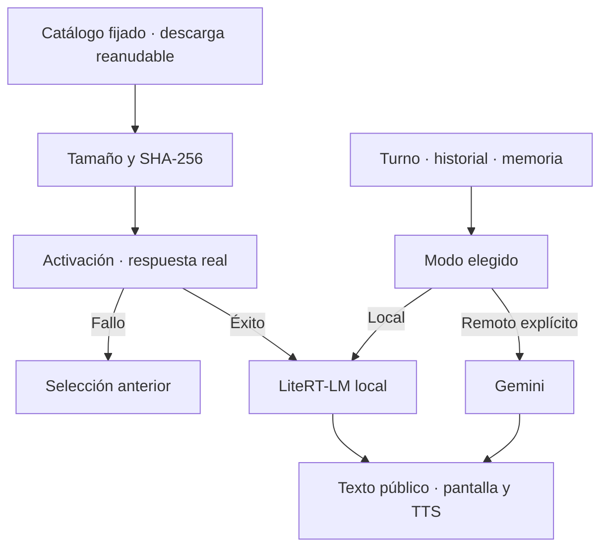
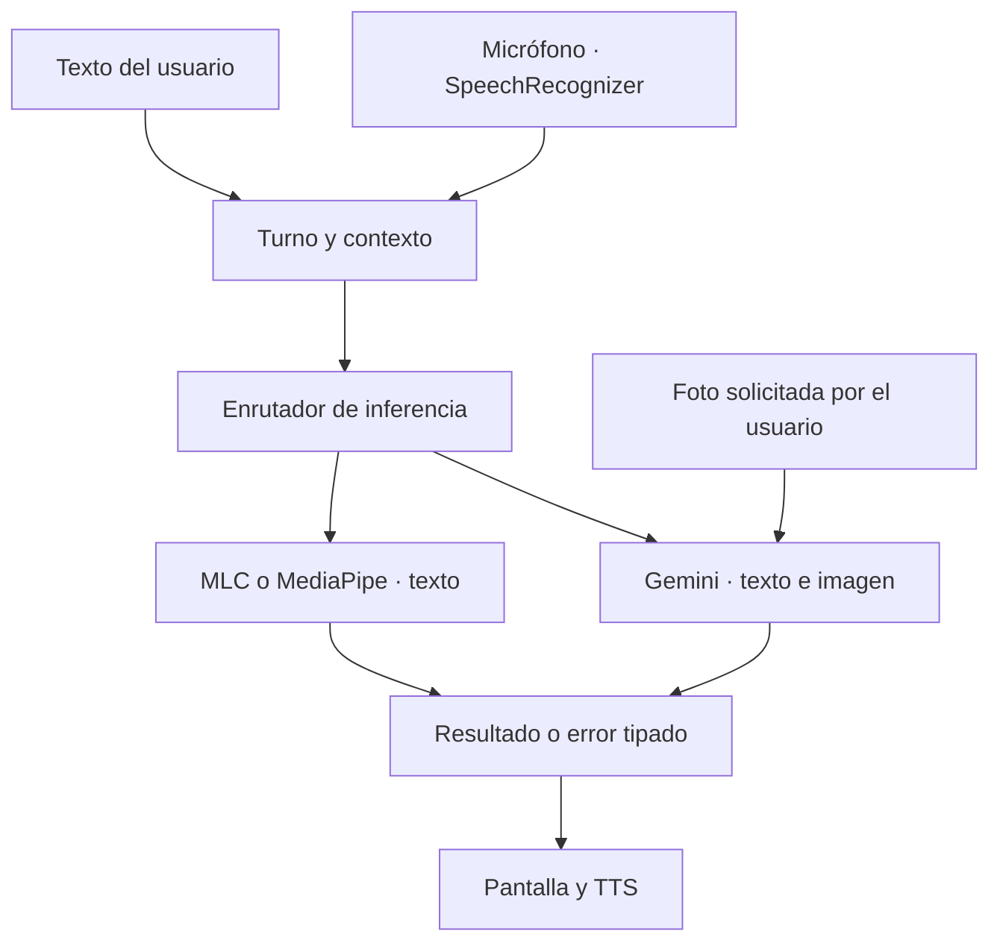

# Auditoría funcional de Salve — 2026-09-21

La revisión posterior a la integración de Gemma —control del móvil, Bluetooth/NSD, herramientas virtuales, avatar y evolución— está en [CONTROL_DISPOSITIVOS_AVATAR.md](docs/CONTROL_DISPOSITIVOS_AVATAR.md). Incluye diagnóstico, decisiones, código conectado, límites y tareas de validación.

## Integración de Gemma 4 E2B para Galaxy S24 Ultra — 2026-09-21

Base de este grupo: `96b4881422832d3191d1ca1b1ac4281e3abcb6da` (incluye la PR 71 y cambios posteriores del propietario).

Se elige **Gemma 4 E2B** por su combinación de tamaño y entrada visual para el S24 Ultra. El paquete general CPU/GPU publicado ocupa **2.588.147.712 bytes (~2,6 GB)**; no se descarga el repositorio completo ni los paquetes NPU de otros chips. Es una base preentrenada de Google, no un modelo entrenado por Salve ni una demostración de superinteligencia.

### Qué cambia

- `config/models.json` contiene un único archivo `.litertlm`, con URL de revisión inmutable, longitud y SHA-256 publicados. Los pesos se descargan al almacenamiento privado `noBackupFilesDir/models`, fuera del APK y de las copias de seguridad. Un gate de `preBuild` impide incorporar pesos `.litertlm`, `.task` o `.gguf` a assets. Los recursos visuales y de voz existentes conservan su empaquetado.
- El primer arranque solicita la descarga mediante un trabajo único de WorkManager, esperando una red no medida (normalmente Wi-Fi). **IA y cámara → Descargar o reanudar Gemma 4 (2,6 GB)** permite reanudarla o autorizar datos móviles. Se puede pausar desde la notificación o el panel y ocultar el panel mientras continúa. La elección de datos móviles actualiza las restricciones del trabajo existente.
- `VerifiedModelFile` descarga a `.part`, valida cada redirección HTTPS antes de conectarse, limita bytes y comprueba longitud/SHA-256 del archivo entero, incluido el prefijo reanudado. Si el servidor ignora Range y devuelve 200, reinicia; valida el Content-Range de 206. Renombra atómicamente solo tras la verificación. Pausar cancela la llamada HTTP activa. Un bloqueo de archivo evita escritores concurrentes, con una espera cancelable breve al reanudar mientras termina el trabajo anterior.
- Se reutiliza el recorrido `ModelDownloader → ModelDownloadRepository → ModelDownloadWorker`. Se retira la descarga automática de repositorios MLC y el catálogo simulado de `BuscadorDescargadorModelos`; sus entradas públicas delegan al mismo catálogo fijado. La importación manual y los motores MLC existentes permanecen. WorkManager usa ahora el constructor estándar de dos argumentos y devuelve fallo cuando falla la preparación; los mensajes finales se leen de `outputData`.
- `.litertlm` usa **LiteRT-LM 0.16.1**, con biblioteca ARM64 publicada incluida en la dependencia; las importaciones `.task` conservan MediaPipe. Se fija 0.16.1 por compatibilidad con Kotlin 2.2; la versión 0.17.1 inspeccionada depende de Kotlin 2.4. GPU es la primera opción y CPU se intenta ante errores de inicialización GPU. Visión se inicializa al solicitar una foto. Contexto máximo inicial: 4096 tokens; salida: 512; espera de generación: 90 segundos. Los canales internos no pasan al chat/TTS.
- La activación ejecuta una respuesta real de texto antes de guardar la selección. La importación manual comparte esa operación serializada; no publica preferencias antes de probar el archivo. Si falla, se restauran las preferencias y metadatos anteriores, también si falla `commit()`. El archivo descargado y verificado puede volver a probarse sin descargarlo. **Una respuesta no vacía verifica ejecución, no corrección ni calidad general.**
- Tras activarse, chat y fotos usan el modo local. Un error local se informa; no sube silenciosamente la consulta a Gemini. Se conserva la elección local/remota al lanzar la cámara. **Usar Gemini** vuelve a habilitar explícitamente el recorrido remoto. El reconocimiento de voz y TTS siguen siendo los servicios Android existentes; este cambio no promete voz íntegramente offline.
- Se retiran el traslado indiscriminado de modelos al arrancar y la selección del archivo más grande al volver a la pantalla. En la base actual esa selección sí tenía una llamada en `onResume` y podía deshacer la selección validada. Las rutas anteriores se conservan y la importación sigue disponible.



### Comprobaciones y límites

- El enlace publicado respondió **HTTP 206**, con `Content-Range: bytes 0-31/2588147712` y cabecera de archivo `LITERTLM`. La redirección observada fue `us.aws.cdn.hf.co`; no hizo falta token para esa lectura. El SHA esperado se obtuvo del puntero publicado de la misma revisión.
- **76 pruebas JUnit JVM** aprobaron: regresiones de conversación, memoria, herramientas, identidad, políticas de voz y protocolo Gemini; transferencia/reanudación/cancelación, enrutamiento local/remoto, catálogo fijado sin pesos en assets y separación de canales privados usando las clases reales de LiteRT-LM. Los transportes controlados de las pruebas de descarga no sustituyen una descarga o inferencia de dispositivo.
- **Inferencia nativa real de texto realizada en Linux x86_64**, con el archivo completo descargado y SHA verificado, `litert-lm-api==0.16.1`, CPU de 4 hilos y contexto de 1024. Devolvió «Hola, Bryan.» en 4,326 s y `391` para 17 × 23 en 0,425 s. Carga: 11,714 s; RSS máximo del proceso: ~3,51 GiB. Son dos observaciones con conversación compartida, no un benchmark ni cifras del S24 Ultra. Se conservaron las limitaciones y advertencias nativas en `docs/validation/gemma4-e2b-linux-2026-09-21.json`.
- Compilación aislada de los Kotlin/Java del núcleo de descarga, wrappers, repositorio, Worker y ViewModel contra AAR/JAR reales de LiteRT-LM 0.16.1, MediaPipe, Android, WorkManager, Lifecycle y OkHttp. Se incluyeron el puente MLC y sus fuentes, sin sustituirlos por inferencia simulada. Sintaxis de Java y XML modificados revisada. Esto no ensambla ni ejecuta el APK.
- La compilación Android completa sigue bloqueada en este entorno: el wrapper de esta base no pudo descargar Gradle **9.7.1** (`Network is unreachable`). No hay APK ensamblado ni prueba en un S24 Ultra. No se ha medido RAM, temperatura, batería ni latencia de voz del teléfono.
- Se amplía `RealInferenceTest` con una foto roja generada cuyos píxeles se envían realmente al motor local. Las pruebas instrumentadas requieren teléfono/emulador y descarga/activación previa; son optativas, no se consideran ejecutadas por existir.
- Para repetir la comprobación Linux: instalar `litert-lm-api==0.16.1` y ejecutar `python scripts/verify_local_model.py --model /ruta/al/archivo.litertlm --output /ruta/al/informe.json`. Comprueba bytes/SHA del catálogo, nombre en saludo y aritmética con el motor real. El CLI se preparó a partir del chequeo ejecutado; se verificaron su sintaxis y ayuda, sin una segunda ejecución nativa.

### Comprobación en el teléfono

1. Compilar con el SDK/Java 21 configurados: `./gradlew :app:testDebugUnitTest :app:assembleDebug`. Instalar el APK resultante en el S24 Ultra.
2. Abrir Salve con unos 3 GB libres y Wi-Fi no medido. Confirmar progreso, pausar, cerrar/reabrir y reanudar. Interrumpir la red: no debe anunciar éxito ni seleccionar `.part`.
3. Esperar la verificación y prueba de respuesta. En **IA y cámara → Estado**, comprobar Gemma y LiteRT-LM GPU/CPU. Probar una pregunta nueva en modo avión. El resto de funciones de red de Salve no forman parte de esta garantía de inferencia local.
4. Probar **Tomar foto y preguntar**, cancelación de cámara y retorno a la pantalla. El modelo elegido debe conservarse. Probar micrófono/TTS y confirmar qué servicios del dispositivo requieren red.
5. Prueba de inferencia instrumentada: `./gradlew :app:connectedDebugAndroidTest -Pandroid.testInstrumentationRunnerArguments.runRealLocal=true -Pandroid.testInstrumentationRunnerArguments.runRealLocalVision=true`.
6. Registrar exactitud, latencia y uso de memoria con conversaciones largas. El historial todavía se limita por mensajes, no por tokens; puede superar la ventana de 4096 y necesita presupuestado antes de afirmar robustez en sesiones largas.

### Próxima evolución medible

Crear un conjunto reservado de tareas de español, transcripciones imperfectas, contexto, código ejecutable y visión. Comparar la versión base con cada cambio de herramientas/configuración o ajuste del modelo, registrando fallos verificables y regresiones. Entrenar/ajustar fuera del móvil y distribuir versiones compactas solo tras esa comparación. La mejora indefinida y la superioridad general siguen siendo objetivos de investigación; no son propiedades demostradas de esta integración.

Fuentes: [paquete y licencia](https://huggingface.co/litert-community/gemma-4-E2B-it-litert-lm), [archivo fijado y SHA](https://huggingface.co/litert-community/gemma-4-E2B-it-litert-lm/blob/6e5c4f1e395deb959c494953478fa5cec4b8008f/gemma-4-E2B-it.litertlm), [API Kotlin de la versión utilizada](https://github.com/google-ai-edge/LiteRT-LM/tree/v0.16.1/kotlin/java/com/google/ai/edge/litertlm).

---

## Auditoría anterior y cambios de la PR 71


Base inspeccionada: `87a9e5204a7d51725c6516438dd5d22bec40f1a7` de `main`.
Este documento sustituye el diagnóstico anterior: tener una clase o una dependencia no demuestra que la función esté operativa. Se distingue entre código conectado, prototipos y pruebas realizadas. No se ha ejecutado el APK en un teléfono durante esta revisión.

## Diagnóstico basado en el código

| Área | Evidencia en el repositorio | Estado antes de este cambio |
|---|---|---|
| Conversación | `MotorConversacional`, `conversation/ConversationSession`, `IntentRecognizer` | Hay cola de turnos, historial y contexto. Tras Gemini se intenta `CognitiveCore.verbalize` antes del LLM conversacional. `Verbalizer` puede devolver plantillas y restringe al LLM a verbalizar estados experimentales, sin el historial conversacional completo. |
| LLM local MLC | `SalveLLM`, `BasicLocalLlm`, `mlc4j`, `mlc-package-config.json` | Existe intención de inferencia nativa y un manifiesto de empaquetado. No hay bibliotecas `.so` versionadas; `fetchTvmRuntime` es opcional y no lo exige `preBuild`. Descargar pesos no proporciona el runtime y la biblioteca compilada necesarios. |
| Puente MLC | `mlc4j/.../JSONFFIEngine.java`, `org/apache/tvm` | El puente busca nombres de funciones globales por coincidencias y trata el retorno de chat como respuesta. El upstream inspeccionado crea un módulo con `mlc.json_ffi.CreateJSONFFIEngine`, obtiene funciones del módulo y registra un callback nativo. La integración local necesita una versión y un ABI compatibles, compilación y prueba real. |
| Modelos descargables | `assets/config/models.json`, `ModelDownloader`, `ModelDownloadWorker` | El catálogo apunta a Qwen2.5-0.5B MLC. Hay descarga y comprobaciones de archivos, pero eso no verifica inferencia. El escáner de MainActivity acepta GGUF aunque SalveLLM no tenga ejecutor GGUF; `checkModelsAndNotify` no tiene llamadas. |
| MediaPipe local | `LiteRTLlm.kt`, dependencia `tasks-genai` | Llama realmente a `LlmInference.createFromOptions` y `generateResponse`. Requiere un `.task`/`.litertlm` compatible y recursos suficientes. No viene incluido un modelo generativo listo para esta ruta. El límite actual de 1024 tokens incluye entrada y salida. |
| Estado del modelo | `BasicLocalLlm.init`, `LiteRTLlm.init`, `SalveLLM.initEngineIfNeeded` | Los wrappers ocultaban fallos; el contenedor marcaba el motor inicializado incondicionalmente. Algunos errores de generación eran texto aparentemente exitoso. MainActivity afirmaba usar Gemma-3 sin comprobarlo. |
| Gemini | `GeminiService` | Había llamadas reales, una clave en preferencias y un modelo fijo `gemini-1.5-flash`, con SDK Android antiguo. No se encontró una llamada a `setApiKey` desde la interfaz. Configurar una clave tampoco comprueba conectividad o cuota. |
| Entrada de voz | `MainActivity.iniciarEscuchaContinua` | Usa `SpeechRecognizer` real. El nombre es engañoso: reconoce un turno, no mantiene una sesión continua. Se iniciaba antes de inicializar vistas si ya existían permisos, y faltaba visibilidad del servicio en el manifest. La ejecución puede depender del servicio de voz instalado y de red. |
| Salida de voz | `MotorConversacional`, `TTSManager`, `SalveAccessibilityService` | Usan TTS real de Android. Hay varias instancias, sin coordinación global. En el chat no se comprobaba la disponibilidad del idioma ni se detenía la salida al abrir el micrófono. |
| Cámara | `VideoAnalysisManager.startAnalysis` y MainActivity | Hay implementación CameraX, pero no se encontró ningún llamador de `startAnalysis`. La cámara continua está expresamente desactivada; el antiguo resultado de foto solo atendía una comprobación facial. El chat pedía frames a un buffer sin productor. |
| Reconocimiento facial | `ReconocimientoFacial`, `ADNVisual` | ML Kit detecta rostros, pero el código acepta el primero y compara una codificación propia de landmarks. Esto no acredita una identidad ni equivale a autenticación biométrica. |
| Memoria de conversación | `conversation/ConversationSession` | Cola en RAM de 16 mensajes. No es persistente ni tiene presupuesto por tokens; las conversaciones largas necesitan resumen y selección del contexto. |
| Memoria duradera | `MemoriaEmocional`, Room/DAO, `memory/*`, grafo | Existe persistencia y políticas selectivas de perfil y olvido. Conviven varios almacenes: hay que verificar consistencia y eliminación entre ellos. |
| Memoria visual | `cognitive/HipocampoSemantico` | La colección está en RAM; cargar/guardar en base de datos conserva TODO. No acredita recuerdos visuales entre reinicios. |
| Embeddings | `EmbeddingsIndex`, ONNX Runtime y asset `gte-small-int8.onnx` | Existe un archivo binario de unos 69 MB y código de inferencia ONNX. Es un modelo de embeddings, no un LLM conversacional. Su carga no se ha probado en dispositivo aquí. |
| Emoción e identidad | `DetectorEmociones`, `IdentidadNucleo`, `ConsciousnessState`, `identity/*` | El detector devuelve siempre `neutro` y su asset no está presente. La identidad persistente es estado funcional simulado; los nombres de clases y niveles no demuestran consciencia ni aprendizaje neuronal. |
| Código experimental | `LocalLlmEngine`, `FallbackEngine`, `Verbalizer`, `LaboratorioSimulado` | `LocalLlmEngine` es un stub sin llamadas encontradas desde el resto del código. Las plantillas de `Verbalizer` sí estaban en la ruta del chat. Un experimento narrado por un modelo no es un experimento ejecutado. |
| Mejora autónoma | `AutoImprovementManager`, outbox y `scripts/auto_improvement_*` | Hay infraestructura de propuestas, aislamiento y PR. No demuestra que los motores de conversación, voz o visión funcionen. No se amplía en este cambio. |

## Problemas prioritarios por categoría

- **Conversación:** plantillas y atajos por palabras como «Bryan», «estado» o «esto es» desplazaban consultas normales. Faltaba informar de que no había un LLM operativo.
- **Razonamiento:** se presentaban hipótesis y estados de módulos experimentales como conclusiones. Hace falta evaluación por tareas, evidencia de herramientas y resultados tipados; no cadenas de pensamiento expuestas.
- **Memoria:** límite por mensajes sin presupuesto de tokens; memoria visual volátil; distintos sistemas de perfil, grafo, diario y sincronización requieren reglas comunes de actualización y olvido.
- **Voz:** arranque prematuro, ausencia de estado compartido para todos los TTS, sin wake word ni VAD propio ni generación/síntesis incremental. No hay interrupción integral de inferencia y audio.
- **Arquitectura:** MainActivity y MotorConversacional concentran muchas responsabilidades; existen varios caminos de generación, detección de modelos y síntesis. Conviene consolidar después de verificar el recorrido básico.
- **Rendimiento:** carga nativa/embeddings, prompts extensos y trabajo autónomo pueden competir con la conversación. No se dispone de mediciones en teléfono. MLC puede esperar un stream sin final; requiere cancelación/timeout con liberación correcta del runtime.
- **Seguridad:** un modelo no verifica identidad. La clave de Gemini es personal y permanece en preferencias privadas de la app; para distribuir un APK con credenciales compartidas hace falta un backend o Firebase AI Logic. Los permisos, versiones y revisión de cambios autónomos siguen siendo necesarios.
- **Experiencia de usuario:** detectar un archivo no significa usarlo. Había estados y mensajes de capacidad sin evidencia, y controles ausentes para conectar un proveedor y analizar fotos.

## Arquitectura elegida y alternativas

Se conserva la aplicación y sus almacenes. El chat utiliza una ruta con resultados tipados. Gemini configurado se intenta primero, manteniendo el orden de la aplicación; si falla, una consulta de texto puede usar el adaptador local. Las fotos requieren el proveedor multimodal y no se degradan a un modelo que no recibió imagen.



| Alternativa | Ventaja | Coste o limitación | Decisión |
|---|---|---|---|
| Gemini mediante REST y dependencias existentes | Texto e imagen con un servicio de inferencia; modelo configurable | Clave, red, cuota y procesamiento externo | Conectar esta vía y permitir probarla desde la app. |
| MediaPipe local existente | Inferencia en dispositivo, sin clave cloud para texto | Modelo compatible, RAM y contexto limitado; API en mantenimiento | Conservar y añadir selección explícita y fallos verificables. Evaluar migración a LiteRT-LM por separado. |
| Reparar MLC completo | Ejecución local con catálogo propio | Empaquetar runtime/bibliotecas y alinear puente Java/JNI con upstream | Trabajo posterior con un único modelo/dispositivo de referencia. No simular éxito mientras falten artefactos. |
| Más capas de verbalización experimental | Permiten investigar estados internos | No sustituyen un modelo entrenado ni la validación de sus resultados | Sacarlas de la respuesta conversacional principal. |

La identidad sigue siendo configuración, memoria y estado funcional. La adaptación futura debe basarse en evaluaciones, versiones de configuración y rollback, sin inferir consciencia a partir de esos mecanismos.

## Cambios de este grupo

1. `MotorConversacional` usa `ConversationModelRouter` y adaptadores de inferencia. Se retira `CognitiveCore/Verbalizer` de esa cascada, la falsa detección emocional y los atajos amplios de identidad/estado. Sin modelo, muestra el fallo; las acciones deterministas conservan su resultado.
2. `SalveLLM`, `BasicLocalLlm` y `LiteRTLlm` propagan fallos y comprueban inicialización. La generación tipada deja de interpretar mensajes de error como texto. La API antigua `generate` conserva cadenas de error para no romper sus consumidores antiguos. La carga nativa inicial se difiere al trabajador; recarga y generación local se serializan. No se inventa `libpenguin.so` ni se selecciona otra biblioteca al azar.
3. `GeminiService` usa REST `generateContent` con OkHttp/Gson existentes y `GeminiProtocol`. El modelo predeterminado es configurable; se usa `gemini-2.5-flash` como valor inicial. Se eliminó la dependencia del SDK Android antiguo. La clave va en cabecera, sin logs; no se siguen redirecciones ni reintentos automáticos. La llamada tiene límite de 45 s. HTTP fallido, bloqueo, truncamiento, JSON inválido y ausencia de texto son errores. Las partes marcadas `thought` no se muestran.
4. MainActivity ofrece **IA y cámara**: configurar/desactivar Gemini, probarlo, seleccionar un archivo local compatible, probar el modelo local y tomar una foto para preguntar. La prueba solicita inferencia real y muestra resultado/latencia o fallo; no marca como verificada una clave guardada. El informe verbal de modelo ya no afirma usar Gemma-3.
5. La consulta visual usa `TakePicturePreview`, el prompt y el historial de texto, y envía los píxeles JPEG al proveedor. Es una foto de resolución reducida, no vídeo, OCR garantizado ni percepción continua. No se adjuntan frames ambientales a todos los turnos. La foto se libera después y no se persiste automáticamente en memoria visual.
6. Voz: permisos bajo demanda, comprobación del servicio, manifest con visibilidad de reconocimiento/TTS/cámara, callbacks de sesiones antiguas ignorados y limpieza al pausar. Se retiran los umbrales agresivos de silencio. El TTS del chat comprueba español y se detiene al empezar a escuchar; otros motores de voz todavía deben unificarse. El botón de frase de prueba se identifica como **Probar voz**.
7. Se excluyen las preferencias con la clave de las copias de seguridad y transferencias Android.

## Tareas y comprobación

| Prioridad / estado | Problema y solución | Archivos principales | Dificultad / riesgo | Comprobación |
|---|---|---|---|---|
| P0, implementado | Plantillas sustituyen inferencia: enrutamiento y errores tipados | `MotorConversacional`, `ConversationModelRouter` | Media; consumidores antiguos conservados | Pruebas de fallback, cancelación y ausencia de modelo; revisar conversación en dispositivo. |
| P0, implementado | Proveedor inaccesible: configuración, REST y prueba real | `GeminiService`, `GeminiProtocol`, `MainActivity`, `app/build.gradle` | Media; red/cuota/compatibilidad de API | Contrato JSON/errores + prueba optativa de texto e imagen contra API real. |
| P0, implementado parcialmente | Modelo local detectado sin ejecutor: selector y carga honesta | `MainActivity`, `SalveLLM`, wrappers Kotlin | Media/alta; formato y memoria del teléfono | Importar modelo conocido y ejecutar inferencia; MLC aún requiere empaquetado compatible. |
| P0, implementado parcialmente | Cámara sin ruta útil y voz frágil: foto explícita y ciclo de vida | MainActivity, MotorConversacional, manifest/layout | Media; proveedores Android y resolución de foto | Cámara, permisos, retorno/cancelación, pausa, TTS y micrófono en equipo real. |
| P1, pendiente | Elegir y consolidar runtime local | `mlc4j`, `LiteRTLlm`, catálogo y build | Alta; JNI, ABI y memoria | Un APK reproducible, sin red, 20 consultas nuevas y 20 turnos con contexto. |
| P1, pendiente | Contexto excede ventana: presupuestar tokens/resumir | `conversation/*`, adaptadores | Media; pérdida de hechos al resumir | Casos largos con correcciones y recuperación de hechos comprobables. |
| P1, pendiente | Voz completa: una sesión con cancelación y streaming | TTSManager, MotorConversacional, MainActivity | Alta; ecos y respuestas obsoletas | Medir fin de habla→primer audio, interrupciones y p50/p95 en dispositivo. |
| P1, pendiente | Memoria visual y olvidos entre almacenes | HipocampoSemantico, Room, memoria/grafo/sync | Alta; privacidad y contradicciones | Guardar, reiniciar, recuperar, actualizar y borrar un recuerdo en todos los almacenes. |
| P2, pendiente | Evaluación de calidad del asistente | `evaluation/*`, casos de prueba | Media; no confundir métricas con comprensión | Evaluar conversaciones y herramientas con respuestas esperadas y revisión humana. |

## Pruebas realizadas y límites

- **52 pruebas JUnit JVM pasaron**, compiladas con objetivo Java 11: 16 nuevas de `GeminiProtocol` y `ConversationModelRouter`, más regresiones de sesión, análisis conversacional, razonamiento, memoria, voz, herramientas, identidad y evaluación. Prueban lógica y contratos; sus proveedores controlados no acreditan inferencia de un LLM.
- `GeminiService`, `GeminiProtocol` y `ModelResult` pasan una comprobación de tipos aislada con objetivo Java 11 contra los JARs publicados de Android, OkHttp 5.3.2, sus dependencias y Gson 2.13.2; no se ejecutó Android en esta comprobación.
- Los siete archivos Java nuevos/modificados de producción/instrumentación pasan análisis sintáctico; los cuatro XML modificados se parsean. Esto no sustituye la comprobación de tipos Android/Kotlin ni el ensamblado del APK.
- `bash gradlew :app:testDebugUnitTest --no-daemon` falló antes de compilar: no se pudo descargar `gradle-9.6.0-bin.zip` (`Network is unreachable`). No se declara un build Android correcto.
- Se añadieron tres pruebas instrumentadas optativas en `RealInferenceTest`: texto Gemini, imagen con píxeles conocidos enviada a Gemini y aritmética con el runtime local. **No se ejecutaron aquí**: faltan un teléfono/emulador, los artefactos/modelo y credenciales del usuario.

En un entorno Android configurado:

```sh
./gradlew :app:testDebugUnitTest
# Configurar la clave en la app antes de habilitar llamadas reales (consumen cuota).
./gradlew :app:connectedDebugAndroidTest -Pandroid.testInstrumentationRunnerArguments.class=salve.core.RealInferenceTest -Pandroid.testInstrumentationRunnerArguments.runRealGemini=true
# Seleccionar un modelo compatible en la app antes de esta prueba local.
./gradlew :app:connectedDebugAndroidTest -Pandroid.testInstrumentationRunnerArguments.class=salve.core.RealInferenceTest -Pandroid.testInstrumentationRunnerArguments.runRealLocal=true
```

Antes de aceptar el APK: probar clave inválida/sin red, ausencia de modelo, una conversación con corrección y referencia al turno anterior, una foto real de objetos desconocidos por el chat, cancelación de cámara, permisos denegados, apertura del micrófono mientras habla y pausa/reanudación. Registrar dispositivo, Android, proveedor de voz, modelo y latencias observadas. MLC sin bibliotecas debe fallar de forma explícita.

El grupo elimina vías concretas de respuesta simulada y conecta controles utilizables. Siguen pendientes la validación integral en teléfono, el empaquetado MLC, streaming, interrupción integral, presupuesto de contexto, consolidación de voz y persistencia visual. No se presenta esta revisión como un asistente completamente operativo.

## Referencias primarias consultadas

- [Gemini generateContent](https://ai.google.dev/api/generate-content): contrato REST.
- [Modelos y retiradas](https://ai.google.dev/gemini-api/docs/deprecations): selección de modelo configurable.
- [SDKs Gemini](https://ai.google.dev/gemini-api/docs/libraries): SDK Android antiguo sin mantenimiento; Firebase AI Logic como alternativa para apps distribuidas.
- [MediaPipe Android](https://developers.google.com/edge/mediapipe/solutions/genai/llm_inference/android): inferencia local, límite de tokens y migración recomendada a LiteRT-LM.
- [Puente MLC upstream](https://github.com/mlc-ai/mlc-llm/blob/main/android/mlc4j/src/main/java/ai/mlc/mlcllm/JSONFFIEngine.java): módulo, funciones y callback nativo.
- [SpeechRecognizer](https://developer.android.com/reference/android/speech/SpeechRecognizer) y [TextToSpeech](https://developer.android.com/reference/android/speech/tts/TextToSpeech): disponibilidad, visibilidad y ciclo de vida.
