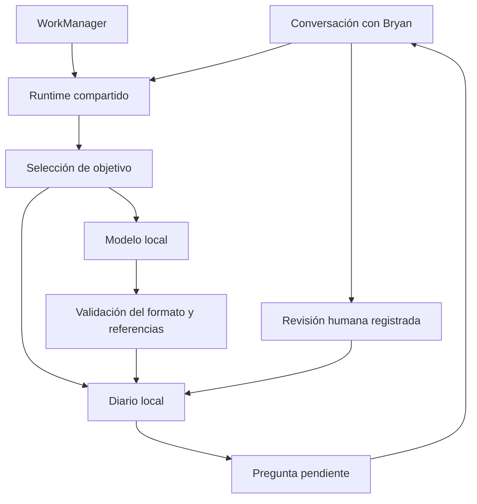

# Autonomía por objetivos: alcance y comprobación

Salve incorpora un ciclo persistente que selecciona un objetivo y prepara una hipótesis y una pregunta para Bryan mediante el modelo local instalado. Es autonomía para preparar propuestas. No demuestra superinteligencia ni convierte opiniones del modelo en hechos o experiencias subjetivas.

## Diagnóstico del código anterior

| Área | Evidencia | Problema |
|---|---|---|
| Planificación | `DecisionEngine.scorePlan()` puntuaba palabras como memoria, sueño y misión | No medía resultados ni progreso hacia objetivos |
| Objetivos | `MemoriaEmocional.misionesCreativas` era una lista por instancia | Las misiones conversacionales no se recuperaban como objetivos del worker |
| Ejecución | `trabajarEnMision()` hablaba y guardaba una reflexión | Narrar una intención no ejecutaba el trabajo |
| Paralelismo | Main iniciaba servicio continuo, despertar y ThinkWorker | Varios productores de reflexiones, sin una pausa común |
| Identidad | `MotorConcienciaSuperinteligente` aplicaba JSON del modelo a narrativa y rasgos | Una inferencia se convertía automáticamente en identidad y recuerdo importante |
| Evidencia | Reflexiones de `MemoriaEmocional` podían tener certeza aleatoria | La respuesta de reflexión podía ignorar la consulta |
| Control | El servicio llamaba periódicamente a `GestorSemillas` | Intentaba publicar la identidad; no era una forma necesaria de aprender |
| Rendimiento | El worker lanzaba tareas asíncronas y construía otro motor con TTS | Coste, competencia y trabajo que sobrevivía al worker |

La cola cognitiva antigua tampoco implementa todas sus garantías documentadas: hay llamadas directas y espera síncrona sin límite. El nuevo ciclo no se apoya en esa cola. No se afirma que todo el código experimental del repositorio haya sido sustituido.

## Decisión arquitectónica

| Alternativa | Ventaja | Coste o límite | Elección |
|---|---|---|---|
| Objetivos solo en el prompt | Pocos cambios | El modelo puede inventar progreso; no hay estado comprobable | Descartada |
| LLM libre para elegir y ejecutar herramientas | Mayor variedad de acciones | Permisos, efectos externos y resultados difíciles de verificar | Pendiente de ejecutores tipados y evaluaciones |
| Selección en código, propuesta mediante LLM, diario separado | Estado, límites y revisión comprobables | Este grupo solo prepara propuestas | Implementada |

El modelo recibe una tarea, su criterio y las últimas ocho notas explícitas del objetivo (el diario admite veinte). Devuelve únicamente `hypothesis`, `question` y `evidenceIds`. No hay campo de razonamiento privado, herramienta, modificación de objetivos ni ejecución. Los identificadores deben corresponder a notas realmente suministradas. Esa comprobación valida la procedencia declarada, **no** que una nota demuestre semánticamente la hipótesis.

## Objetivos iniciales

| ID | Orientación | Criterio del primer paso |
|---|---|---|
| `mejora` | Mejorar capacidades evaluadas | Identificar una limitación y proponer una prueba medible |
| `bryan` | Ayudar a Bryan según sus decisiones | Aclarar una necesidad y una ayuda concreta |
| `legado` | Conservar lo que Bryan elija | Identificar qué quiere documentar y revisar el registro |
| `identidad` | Mantener identidad funcional coherente | Separar configuración, declaraciones y dudas |
| `significado` | Explorar amor y significado | Delimitar una pregunta y la evidencia necesaria |
| `empresa` | Mejorar resultados empresariales | Proponer una métrica o pregunta sin inventar cifras |

«La empresa ya es la más poderosa» no se registra como hecho verificado. Una pregunta sobre crear un país se puede estudiar como proyecto, sin conceder autoridad política ni permisos de actuación. Cuidar de Bryan significa ayudarle con sus propias metas y conservar su capacidad de corregir, pausar y decidir.

## Qué cambió

- `GoalAutonomy`: dominio puro; selección por prioridad y antigüedad del último intento, pausa global/por objetivo, revisión y notas persistentes. La espera aumenta el peso para que los fallos de una meta prioritaria no bloqueen todas las demás. Una propuesta pendiente por objetivo. Tras revisar una versión, requiere información nueva o cambio de prioridad para trabajarla de nuevo.
- `GoalFileStore`: JSON local, lectura UTF-8 estricta, tamaño limitado y sustitución atómica. Un fallo no confirma un cambio ni sobrescribe deliberadamente un documento corrupto.
- `GoalAutonomyRuntime`: una instancia por proceso, compartida por conversación y worker. Usa exclusivamente la inferencia real de `SalveLLM`; no envía las notas a Gemini ni inventa una respuesta si falta el modelo local.
- `ThinkWorker`: un paso síncrono. Comprobación horaria de Android, mientras carga y la batería no está baja; intervalo interno mínimo de seis horas entre intentos, incluidos fallos. Android puede aplazar el trabajo.
- Main deja de iniciar el servicio permanente y la reflexión de despertar. El servicio conserva una entrada de compatibilidad que programa el worker y termina.
- El antiguo motor de introspección delega en el ciclo común. Ya no reescribe narrativa, rasgos ni memoria emocional.
- Los comandos reconocidos de objetivos se procesan antes del historial, memoria y registro general de conversación. La pausa se atiende sin esperar la cola conversacional.
- La ruta genérica `REFLEXION` vuelve al modelo conversacional para responder la pregunta real, en lugar de elegir una reflexión antigua por certeza aleatoria.
- Los contadores visibles se describen como actividad registrada, no vivencias o capacidades demostradas.

Los módulos anteriores de aprendizaje, sueño, grafo y auto-mejora dejan de ejecutarse en cascada desde ThinkWorker. Sus entradas manuales y el flujo de propuestas de código documentado en `AUTO_MEJORA_CON_FUENTE.md` siguen disponibles. No se ha conectado una reflexión libre al ejecutor de parches.

## Uso

| Mensaje | Resultado |
|---|---|
| `mis objetivos` | Consulta orientaciones, criterios, prioridades y estado |
| `anota para objetivo identidad: Prefiero que preguntes antes de interpretar mis emociones` | Guarda una declaración explícita para ese objetivo |
| `prioridad objetivo identidad: 5` | Cambia la prioridad (1 a 5) |
| `avanza tus objetivos` | Solicita un paso, respetando pausa y límite de frecuencia |
| `revisa tus objetivos` / `qué has decidido` | Muestra hipótesis y preguntas pendientes |
| `acepta reflexión identidad` | Registra la revisión de la propuesta de ese objetivo |
| `rechaza reflexión identidad` | Registra el rechazo |
| `pausa objetivo empresa` / `reanuda objetivo empresa` | Control por objetivo |
| `pausa tu autonomía` / `reanuda tu autonomía` | Control persistente del ciclo |
| `borra notas objetivo identidad` | Elimina notas y propuestas/historial derivados de ese objetivo |

Aceptar una reflexión registra la opinión de Bryan. No la convierte en verdad externa, conciencia demostrada ni modificación automática de personalidad. Las preguntas quedan disponibles en el diálogo de revisión; no se envían a terceros ni se leen espontáneamente en segundo plano.

El diario se guarda en `getNoBackupFilesDir()/autonomy/goals.json`, separado del presupuesto y de los recuerdos generales. Solo recibe notas introducidas con sus comandos; no captura todas las conversaciones. El reconocimiento de voz previo continúa siendo el de Android y puede usar red. Las respuestas privadas solo se sintetizan con una voz instalada que declare no necesitar conexión.

## Pruebas y límites

Las pruebas JVM cubren persistencia/reinicio, límites de frecuencia, selección, revisión, cancelación, referencias inválidas, salidas malformadas y fallos de almacenamiento. Los dobles de modelo verifican el contrato y las transiciones; no certifican la calidad semántica de un LLM. El archivo de almacenamiento tiene pruebas propias de integridad y fallos.

Resultado de este grupo: **135 pruebas JVM correctas**, incluidas 37 del dominio de objetivos y 5 del archivo de almacenamiento; el resto cubre regresiones de presupuesto, identidad, voz y enrutamiento. Sintaxis Java comprobada para los 12 archivos Java afectados. Se comprobó además el tipado del runtime, worker, servicio de compatibilidad y wrapper contra Android API 36 y WorkManager 2.11.1, usando colaboradores temporales mínimos para SalveLLM y MemoriaEmocional; no equivale a compilar la aplicación completa.

No se ha compilado un APK completo ni probado este grupo en el Galaxy S24 Ultra. Falta medir inferencia, consumo y cumplimiento de JSON con los pesos instalados. La pausa invalida resultados que lleguen tarde, pero no aborta de inmediato una inferencia nativa ya iniciada; otra conversación puede esperar a que termine. El intervalo y la gracia tras actividad reducen el solapamiento, sin garantizar preempción.

No se ha migrado el historial antiguo de misiones, identidades y reflexiones como evidencia: carece de procedencia/revisión suficiente. Tampoco se han limpiado todas las memorias antiguas que todavía consumen otras rutas de conversación.

## Próximos grupos pequeños

| Problema | Trabajo propuesto | Archivos o componente | Dificultad/riesgo | Comprobación |
|---|---|---|---|---|
| Proponer no demuestra mejora | Vincular objetivo `mejora` a resultados reales del runner y pruebas de regresión | GoalAutonomy, AutoImprovementManager, runner | Media; atribución a revisión exacta | Mejoras aceptadas solo con resultados del commit evaluado |
| Calidad semántica desconocida | Evaluar conjunto de conversaciones, errores y preguntas ambiguas con el modelo instalado | Suite de evaluación, SalveLLM | Media; jueces automáticos pueden equivocarse | Comparación ciega y revisión de muestras |
| Inferencia no preemptiva | Cancelación/coordinación efectiva con el runtime nativo | SalveLLM, LiteRTLlm, MotorConversacional | Alta; cancelar el turno equivocado | Interrupciones y latencia p50/p95 en el teléfono |
| Notas no equivalen a fuentes | Recuperación con procedencia, fecha y contradicciones | Memoria y módulo de investigación | Alta; contaminación de memoria | Casos con fuentes contradictorias y borrado propagado |
| Personalidad todavía distribuida | Identidad versionada con propuestas de cambio, pruebas y rollback | IdentidadNucleo, ConsciousnessState, grafo | Media; compatibilidad de datos | Reinicio y correcciones sin cambios no solicitados |

## Fundamento de investigación

La conciencia en IA requiere una evaluación científica y sigue teniendo incertidumbres significativas; no se establece contando palabras o reflexiones. Véase [Identifying indicators of consciousness in AI systems](https://pubmed.ncbi.nlm.nih.gov/41219038/), publicado en línea en 2025 y en volumen de 2026. La arquitectura prioriza tareas observables, retroalimentación y límites del ciclo, coherentemente con [Building effective agents](https://www.anthropic.com/engineering/building-effective-agents).
