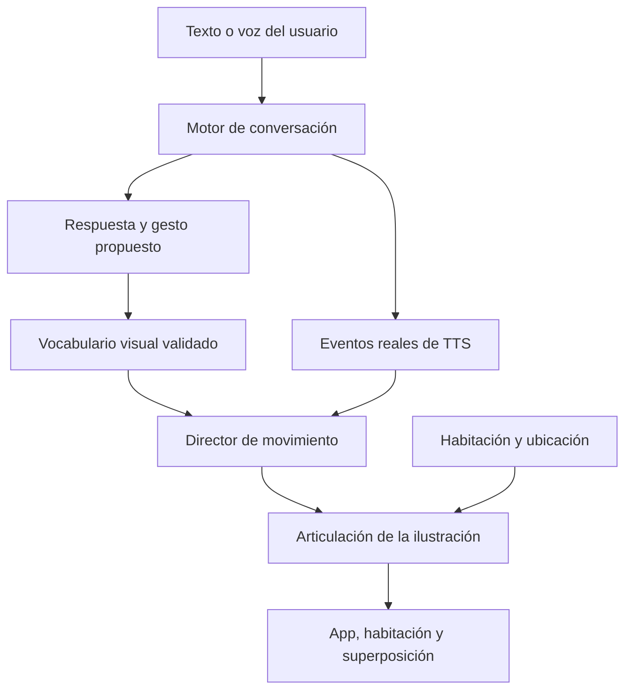

# Salve ilustrada: identidad visual y movimiento conversacional

Corrección solicitada tras la PR 73, sobre `40ad6f2c54e54c4dd98c39a7d80f738768bc8fd1`.

## Qué se había entendido mal

El personaje geométrico anterior permitía caminar y cambiar de estado, pero reemplazaba la apariencia que el usuario quería conservar. `AvatarView.drawCharacter()` no utilizaba la ilustración existente. Además, los movimientos dependían de botones y órdenes específicas; no había un director de gestos conectado a la conversación ni eventos de voz que animaran la boca.

La referencia adjunta y `app/src/main/res/drawable/salve_imagen.png` son el mismo archivo: PNG de 1024 × 1536 con transparencia, SHA-256 `32346faf7219f417eb0983262ae7ac20a2e80063781a0ea32b843d3eb03fb0ec`. Ese dibujo es la fuente de identidad: rostro, ojos, pelo, proporciones, vestido y botas. Se conserva sin modificar.

La segunda imagen expresa el objetivo de una figura que elija gestos según el diálogo. Sus textos sobre consciencia son una descripción conceptual, no una propiedad demostrada del software.

## Elección técnica

| Alternativa | Ventaja | Coste o límite |
|---|---|---|
| Articulación 2D de la ilustración | Conserva los píxeles originales, pequeña y sin otro motor gráfico | Amplitudes limitadas; hay que completar partes ocultas al separar miembros |
| Poses ilustradas o sprites | Permite revisar artísticamente cada pose | Necesita varias imágenes y transiciones; no ofrece articulación arbitraria |
| Cubism/Live2D | Deformadores, expresiones y movimientos diseñados para ilustración | Requiere preparar y exportar un modelo real, además del SDK |
| Modelo 3D con esqueleto | Permite vistas de espalda, giros y movimientos espaciales | Necesita malla, texturas, esqueleto y animación; el PNG frontal no los contiene |

Se elige articulación 2D conservadora para este cambio. `Live2DCanvasView` sigue siendo un placeholder previo, no se lo presenta como motor instalado. No se añade una dependencia que prometa convertir automáticamente el PNG en un modelo completo.

## Componentes y flujo



- **AvatarMotionProtocol:** pequeño vocabulario de gestos y expresiones. Una respuesta puede terminar con `[[salve_motion:WAVE:WARM]]`. El parser retira los metadatos antes de historial, evaluación y voz; los valores desconocidos, múltiples o malformados no se ejecutan. Este canal no es código ni una herramienta para operar el móvil.
- **AvatarMotion:** estado transitorio puro. Coordina atención, espera, gesto, mirada, parpadeo, respiración y boca. Aplica límites, transiciones y caducidad; no guarda supuestas emociones ni conversaciones.
- **AvatarMotionController:** comparte el estado entre vistas en el hilo principal, con una sesión explícita. Un motor creado por un worker de fondo no obtiene control del personaje por existir. Los identificadores de turno y locución descartan eventos antiguos.
- **MotorConversacional/MainActivity:** conectan entrada, generación, respuesta, escucha y locuciones. El gesto puede ser elegido por el mismo modelo que responde; no se hace una inferencia adicional por fotograma. Si no llega una propuesta válida, hay comportamientos de respaldo acotados para actos como saludar o pedir una explicación.
- **AvatarView y renderer ilustrado:** dibujan la textura original con articulaciones y conservan el desplazamiento, habitación y cama. La neutralidad visual tiene como referencia el PNG original, no una nueva cara generada.
- **AvatarStore/AvatarState:** mantienen ubicación y habitación. Las expresiones y la locución se separan de esa persistencia: un saludo de ayer no es una emoción que deba conservarse hoy.

La apertura de boca depende de `UtteranceProgressListener`: empieza con `onStart`, puede modularse con `onRangeStart`, y se cierra con fin, error, parada o interrupción. Es sincronización temporal aproximada; no extracción de fonemas ni análisis de la señal de audio. Una respuesta solo textual no se anuncia como audio reproducido.

## Apariencia y capacidades

El objetivo de los gestos es acompañar la conversación: una bienvenida puede tener un saludo breve, una explicación una postura abierta y una petición de aclaración una inclinación de atención. La expresión visual no diagnostica cómo se siente el usuario.

Se mantienen brazos y cabeza dentro de amplitudes pequeñas para conservar la ilustración. Mover, inclinar o reflejar una figura frontal no se denomina giro tridimensional. La selección automática se limita a un repertorio de movimientos preparados y combinables; no produce cualquier animación nueva a partir de texto.

La capa auxiliar de pelo se generó con Image Generation integrado, usando la ilustración como referencia y pidiendo exclusivamente pelo posterior para rellenar zonas antes ocultas. No sustituye el rostro ni el vestido originales. Su uso se limita a las máscaras del rig; no se muestra como una figura alternativa. Se conserva la [instrucción de generación](evidence/avatar-hair-fill-prompt.txt) para revisar su procedencia.

La ropa geométrica anterior no es compatible con esta identidad visual. La habitación conserva el vestido original y explica que los pijamas y otras prendas necesitan ilustraciones compatibles. El color de la manta sigue disponible. Las órdenes de ponerse un pijama ya no afirman un cambio visual inexistente; el estado previo de habitación se conserva.

Ejemplos conectados a la conversación:

```text
Hola Salve
Salúdame con la mano
Asiente con la cabeza
Niega con la cabeza
Haz un gesto de explicación
Mírame
```

## Comprobaciones y continuación

La validación debe incluir tanto lógica como apariencia. Las pruebas del director cubren límites, propietarios, turnos obsoletos, interrupciones, caducidad y eventos TTS. El parser cubre sufijos válidos, ausentes, desconocidos y malformados. Una revisión visual comprueba parecido, uniones, recortes y movimientos: que compile no demuestra que se vea bien.

La compilación Android con SDK 36, JBR 21 y Gradle 9.7.1 terminó correctamente: **225/225 pruebas aprobadas en 37 suites**, sin fallos, errores ni omisiones. Se ejecutaron `:app:testDebugUnitTest` y `:app:assembleDebug` con `scripts/android-arm64.init.gradle`. El APK de prueba ocupa **142,815 MiB** (149.751.883 bytes), contiene únicamente bibliotecas `arm64-v8a` y su firma APK v2 se verificó correctamente. Los pesos del LLM siguen fuera del APK; el modelo de embeddings existente se conserva. El PNG original empaquetado tiene el mismo SHA-256 que la fuente. [Evidencia de compilación](evidence/reactive-avatar-build.json).

SHA-256 del APK `salve-s24-reactive-avatar-debug.apk`:

```text
7fcc09b7c96b42b6824b710d6b598b8587bb5b70db830822b8223fb061b1b6e1
```

Se revisaron **12 poses** en la [vista previa reproducible](../tools/avatar-preview/README.md), incluyendo los recortes corregidos de manos y botas. La comparación entre Original y Neutro a **512 × 768** obtuvo **0 diferencias en 393.216 píxeles**, incluyendo alfa, y no se registraron errores JavaScript. [Evidencia visual](evidence/reactive-avatar-visual-check.json). Esta comprobación utiliza un navegador y una secuencia programada del director: no ejecuta Android, no reproduce TTS real y no constituye una prueba en el S24 Ultra.

Se probó el modelo **Gemma 4 E2B real** con LiteRT-LM 0.16.1 en CPU Linux (cuatro hilos), reutilizando los pesos verificados, sin descarga ni red. Con la instrucción inicial produjo una directiva válida de tres casos. Sustituir marcadores genéricos por ejemplos completos dio **tres directivas válidas en los mismos tres casos**: saludo → `WAVE:WARM`, explicación → `EXPLAIN:NEUTRAL`, petición de saludo → `WAVE:WARM`. El parser Java de producción no expuso metadatos en ninguna de las seis respuestas. Tiempos posteriores: 1,389 / 1,826 / 1,160 segundos. Estos tres ejemplos con contexto breve no son una evaluación general ni una medición de latencia en el S24; tampoco prueban el prompt completo con memoria y herramientas. [Evidencia anterior](evidence/motion-inference-baseline-result.json) y [posterior](evidence/motion-inference-result.json).

Pendiente en el Galaxy S24 Ultra: comprobar el motor de voz instalado, escala/densidad, superposición y consumo. La vista previa de desarrollo ayuda a evaluar el rig; no certifica el comportamiento del dispositivo físico.

Para ampliar movimientos sin perder calidad: preparar un archivo de ilustración por capas con torso, brazos, manos, pelo y rasgos faciales completos; añadir vistas laterales y espalda si se necesitan giros; crear prendas sobre ese mismo rig. Después se puede comparar Cubism con el renderer actual usando las mismas escenas y medidas de tiempo de frame/memoria.

Documentación primaria: [Canvas de Android](https://developer.android.com/reference/android/graphics/Canvas), [eventos de síntesis de voz](https://developer.android.com/reference/android/speech/tts/UtteranceProgressListener), [modelo Cubism Java](https://docs.live2d.com/en/cubism-sdk-manual/model-java/), [esqueletos en glTF](https://registry.khronos.org/glTF/specs/2.0/glTF-2.0.html#skins).
