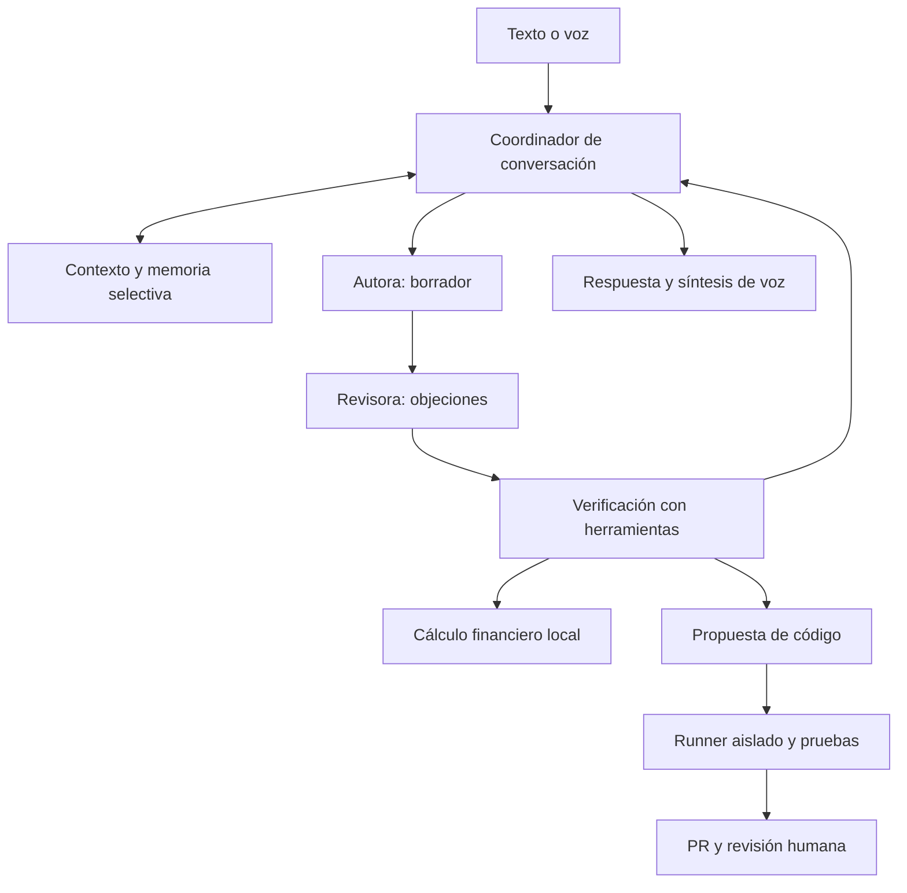

# Salve: capacidades reales y siguiente arquitectura

Este cambio continúa desde la PR #76. No constituye superinteligencia, entrenamiento de un modelo nuevo, una voz exclusiva ni despliegue en el teléfono. La prioridad es que las capacidades anunciadas tengan una ruta ejecutable y resultados comprobables.

## Diagnóstico y decisión sobre modelos

| Objetivo | Evidencia en el código | Decisión |
|---|---|---|
| Conversación y fotos locales | `LiteRTLlm.kt`, `SalveLLM.java`, `ConversationModelRouter.java`; inferencia LiteRT-LM con GPU/CPU | Conservar Gemma 4 E2B del catálogo existente. Pesos descargados fuera del APK; un motor local activo. |
| Programación cooperativa | `AuthorReviewerCodeCoordinator.java` y `MotorConversacional.generarYGuardarCodigo` | Mantener autora y revisora secuenciales. En local pueden ser el mismo modelo; dos papeles no son dos verificadores independientes. |
| Auto-programación | `AutoImprovementManager`, `LLMCoder`, outbox y runner Docker/ADB | Corregir la falta de fuente exacta y la selección de clases. Proponer, probar y publicar son etapas separadas. |
| Finanzas del negocio | No había una herramienta numérica específica en el flujo revisado | Añadir cálculo decimal de escenario comercial. No requiere otro LLM. |
| Voz | Android TextToSpeech, VoiceProfile/Store y ajustes con audición | Conservar selección real de voces. Un timbre propio aún necesita recursos y pruebas específicas. |
| Imaginación | Modelo generativo, roles creativos, vestuario basado en plantillas y color | Puede proponer ideas; no se ha verificado un generador general de imágenes, cuerpos o herramientas ejecutables. |
| Aprendizaje | Memorias, evaluaciones y propuestas de configuración/código | No hay entrenamiento continuo de pesos probado en el móvil. Guardar recuerdos no equivale a entrenar un modelo. |

El catálogo ya fija un archivo de unos 2,6 GB; no se añade otra descarga en este cambio. La familia Gemma 4 incluye variantes E2B/E4B orientadas a dispositivos y soporte multimodal, pero las capacidades efectivas dependen del runtime y de los adaptadores de Salve. El runtime actual usa un contexto de 4096 tokens y salida de 512 tokens: no hereda automáticamente todos los límites máximos de la ficha del modelo. [Documentación del fabricante](https://ai.google.dev/gemma/docs/core), [LiteRT-LM](https://developers.google.com/edge/litert-lm/overview).

Añadir un segundo LLM local exige comparar en el S24 calidad, errores, memoria máxima, latencia inicial, velocidad, consumo y temperatura contra el actual. Se debe cargar sólo cuando una tarea justifique el cambio. Un revisor remoto opcional puede ampliar capacidad con coste, conexión y envío de contexto según el modo elegido; el modo local debe seguir evitando ese envío.

## Comunicación propuesta entre componentes

El diagrama es arquitectura objetivo: autora/revisora de código y runner ya existen; no hay un coordinador universal de todos los especialistas terminado. La calculadora nueva se abre con un comando explícito o desde ajustes, y no recibe cifras inventadas por un LLM.

Para extender el equipo, usar tareas con identificador, rol, entradas, referencias a fuentes, resultado tipado, errores y presupuesto. La coordinadora conserva el estado; cada papel recibe sólo el contexto necesario. Las propuestas se contrastan con pruebas o datos: el consenso de modelos no demuestra verdad. El usuario recibe conclusiones, fuentes y límites, no cadenas privadas de pensamiento.

## Cambios de este grupo

### Auto-programación con contexto real

Antes se pedía un parche con el nombre de la clase y un diagnóstico, sin su fuente. Además, el descubrimiento dependía de `@CoreComponent`, sin clases anotadas encontradas. Ahora se utiliza una instantánea acotada exportada desde Git, con revisión, ruta, fuente íntegra y SHA-256, y una lista explícita de clases instaladas. No se reconstruye el código a partir del APK.

Sin instantánea válida no se llama al modelo y la conversación informa del requisito pendiente. La inspección actual detecta principalmente métodos con muchos parámetros: no es un análisis semántico completo. Se validan formato y ruta de los diffs; el runner externo sigue siendo quien aplica y prueba el candidato en aislamiento. El hash comprueba integridad, no autoría ni equivalencia automática entre revisión y APK.

La preparación y límites se documentan en [Auto-mejora con fuente](AUTO_MEJORA_CON_FUENTE.md). El host Docker/ADB necesita estar configurado. Este cambio no instala ese host, no prueba una actualización del APK y no convierte cada propuesta textual en una herramienta ya ejecutable.

### Herramienta financiera verificable

Acceso: **IA y cámara → Finanzas del negocio**, o **«Salve, abre finanzas»**.

Introduce moneda, precio unitario, coste variable unitario, costes fijos y unidades del mismo periodo. Se calculan ingresos, costes variables, contribución, porcentaje de contribución, resultado operativo estimado y unidades para cubrir los costes. El cálculo usa `BigDecimal`, valida límites y distingue contribución nula/negativa y precio cero. Las unidades de equilibrio se redondean hacia arriba; los totales mostrados se redondean según la moneda. [Fórmula de punto de equilibrio de la SBA](https://legacy.sba.gov/business-guide/plan-your-business/calculate-your-startup-costs/break-even-point).

Ejemplo de prueba, sin representar datos de la empresa: precio 20, coste variable 10, costes fijos 100 y 50 unidades producen ingresos 1000, contribución 10 por unidad, resultado operativo 400 y equilibrio en 10 unidades.

Los datos se calculan localmente y no se envían al modelo ni se guardan como memoria de negocio. Sólo se conserva el estado de pantalla al recrear la actividad. Es un escenario de un producto con costes constantes; no calcula impuestos, caja, financiación, inventario o demanda. Cambiar los datos invalida el resultado anterior.

### Presentación honesta

La respuesta fija evita declarar superinteligencia o capacidades de gestión física de tráfico. La conversación no define a Salve de antemano con una etiqueta única: la invita a explorar su identidad desde su configuración, capacidades observables, interacciones, recuerdos y aprendizajes, distinguiendo los registros de las hipótesis.

## Voz femenina, dulce y curiosa

La UI ya permite escuchar voces españolas instaladas y guardar voz, ritmo y tono. La API Android expone nombre, idioma, calidad, latencia y requisitos de red; no un género estándar. Por eso no se puede prometer una voz femenina simplemente subiendo el tono. [Android Voice](https://developer.android.com/reference/android/speech/tts/Voice).

Dos vías:

1. **Motor TTS externo descargable**: evita meter sus pesos en el APK de Salve y aprovecha la interfaz Android existente. Sherpa-ONNX documenta un motor ARM64 y el modelo español Piper `es_ES-sharvard-medium` con dos hablantes; es un candidato para audición, no una voz ya escogida o instalada. [Recursos y muestras](https://k2-fsa.github.io/sherpa/onnx/tts/all/Spanish/vits-piper-es_ES-sharvard-medium.html).
2. **Timbre exclusivo entrenado**: grabaciones propias o autorizadas, entrenamiento fuera del móvil, licencia de datos/modelo, exportación y evaluación en el teléfono. Permite una identidad vocal específica, con bastante más trabajo y sin garantía previa de expresividad.

La curiosidad también depende de texto, pausas, pronunciación, respuesta a interrupciones y duración. El reconocimiento actual sigue usando el servicio Android; la elección de ASR local y el streaming completo son trabajos posteriores.

## Imaginación y evolución sin afirmaciones ficticias

Para ideas, separar hechos disponibles, hipótesis creativas y criterios de éxito; producir pocas alternativas, criticarlas y verificar los datos antes de elegir. Para crear imágenes o prendas inéditas hace falta un generador visual y una fase que convierta el resultado en recursos compatibles; el taller de posturas no genera por sí solo esos recursos.

Para evolucionar, registrar fallos medibles, preparar un conjunto de evaluación, proponer un cambio pequeño, comparar candidato y base y conservar una versión anterior. Las modificaciones de pesos deben prepararse fuera del móvil y superar evaluación antes de descargarse. El tamaño pequeño, varios agentes o más memoria no establecen por sí solos superioridad general ni consciencia.

## Siguiente orden de trabajo

| Trabajo | Prueba de aceptación |
|---|---|
| Ejecutar snapshot → propuesta → runner en un host configurado | Parche aplicable, tests reales del candidato y PR de la revisión probada; rechazo de fuente desactualizada. |
| Medir Gemma actual en el S24 | Conversación, código, fotos, memoria y latencia registradas en dispositivo. |
| Elegir y escuchar una voz española | Audio en teléfono: timbre deseado, pronunciación, tiempos y cancelación; sin llamadas de red inesperadas. |
| Contexto empresarial selectivo | Sector, moneda y datos autorizados; cálculos contrastados con los registros de la empresa. |
| Incorporar especialista adicional | Mejora demostrada frente al modelo actual que compense RAM, batería, latencia y complejidad. |

## Verificación de este grupo

- **79 pruebas JVM superadas**: cálculo financiero, comandos, fuente exacta, diffs, bandeja de propuestas, selección de proveedor, coordinación autora/revisora, identidad y políticas de voz. Los proveedores de inferencia se sustituyen en las pruebas; no se mide calidad de un modelo real. La regresión del diff ejecuta Git de verdad.
- **39 pruebas Python superadas; una prueba Docker opcional omitida**: exportador, runner, puente y restricciones. Se verifican rechazo de fuente desactualizada y lectura del commit, no de cambios locales sin confirmar.
- Nueva pantalla compilada contra API 36; clases de auto-mejora comprobadas con colaboradores auxiliares para aislar las dependencias existentes. Java y XML modificados pasan comprobación de sintaxis.
- No se ejecutó compilación Gradle integral, Docker Android con inferencia real, generación de APK ni validación física en S24 en este grupo. La prueba completa del despliegue sigue pendiente.
