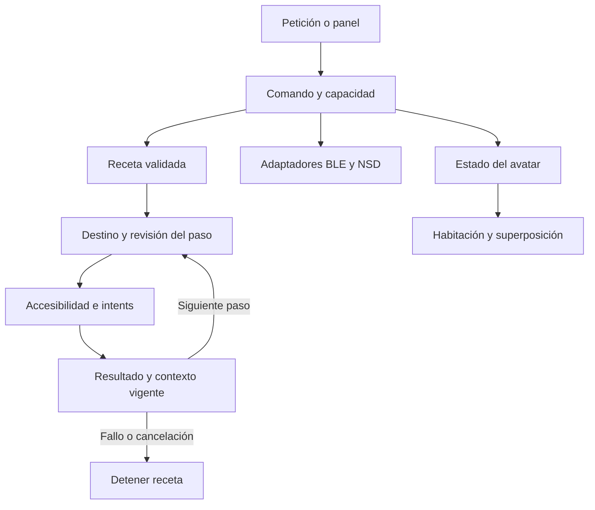

# Salve: control del móvil, dispositivos, herramientas y avatar

**Actualización visual posterior:** [avatar ilustrado y reactivo](AVATAR_ILUSTRADO_REACTIVO.md). El vestuario geométrico y el dibujo simplificado descritos en este informe corresponden a la PR 73; la corrección conserva la ilustración original y conecta los gestos al diálogo.

Auditoría e implementación sobre `7f692e203491396205ae698dd8a62d2a260a2869`, que ya incorpora Gemma 4 y LiteRT-LM. Fecha: 2026-09-21.

## Diagnóstico del sistema recibido

Se recorrió la estructura completa y las rutas de producción: 182 archivos Java/Kotlin bajo `salve`, además del puente MLC, recursos, pruebas y scripts externos. Se siguieron llamadas desde MainActivity, MotorConversacional, servicios, memoria, herramientas y evaluación. La existencia de una clase no se considera evidencia de ejecución.

| Área | Evidencia antes de este grupo | Problema y alcance |
|---|---|---|
| Conversación y modelo | MotorConversacional, SalveLLM, LiteRTLlm, ConversationSession | Modelo real integrado en PR 72; historial de 16 mensajes sin presupuesto por tokens. Persisten varios atajos por palabras y rutas experimentales. |
| Control de apps | SalveAccessibilityService: gestos, nodos y ACTION_SET_TEXT | API real, pero escribía en el primer campo, ignoraba el resultado, retenía coordenadas antiguas y podía actuar tras cambiar pantalla. |
| Lectura de pantalla y voz | onAccessibilityEvent creaba otra ruta de decisión, memoria y reconocimiento | Leía/registraba texto automáticamente, podía invocar Gemini en el hilo principal y duplicaba micrófono, TTS y motor conversacional. |
| Rutinas | MemoriaProcedimental | Cada 1,5 segundos sustituía una propuesta pendiente por la siguiente; anunciaba éxito sin ejecutar la secuencia. Los nombres se reducían a la primera palabra. |
| WhatsApp y apps | Sin implementación WhatsApp; visibilidad de paquetes insuficiente | No existía envío ni preparación de mensajes. Abrir apps podía fallar por no declarar consultas de launcher. |
| Bluetooth y Wi-Fi | GestorConectividad | Sin permisos Bluetooth, GATT ni NSD. Wi-Fi usaba addNetwork, incompatible con el target de la app. Leer estado podía lanzar SecurityException. |
| Avatar | PNG y float_animation; Live2DCanvasView | Imagen completa movida como bloque. Live2D es un placeholder sin SDK, modelo ni controlador conectado. No había cama, vestuario o marcha articulada. |
| Creación visual | ObjetoCreativoView dibuja formas y glifos | Canvas real. El comando de glifo omitía EXTRA_FORMA y terminaba dibujando un círculo. |
| Evolución | GradleSandboxTestExecutor, ValidationSandbox, LLMCoder | El ejecutor devolvía éxito aunque Gradle fallara. El prechequeo de texto se confundía con pruebas; el ejecutor local no aplica el parche candidato. LLMCoder podía usar Gemini aun en modo local. |
| Autoanálisis y plugins | CodeAnalyzerEnhanced, AppIntegrator | Ninguna clase de producción anotada con @CoreComponent; análisis limitado a número de parámetros. El descubrimiento de plugins no tiene consumidor que ejecute sus herramientas. |
| Memoria y aprendizaje | Room/perfil/borrado, ConceptSpace y OrganoSensorialWeb | Hay almacenamiento real, pero no caducidad/olvido común a todos los almacenes. Vectores aleatorios o constantes no acreditan entrenamiento ni mejora del LLM. |
| Mejora externa | Outbox, scripts de runner Docker y puente ADB | Código real para propuestas/parches; requiere equipo e imagen externa. El runner no incorpora generatedTests y las propuestas no reciben siempre el código exacto. No se ha probado el recorrido completo aquí. |

## Decisiones e implementación

Se conserva la aplicación, el modelo y los almacenes existentes. No se instala código arbitrario generado por el modelo. Las herramientas nuevas son recetas de operaciones que la aplicación sabe ejecutar y comprobar.



| Elección | Alternativas consideradas | Motivo y límite |
|---|---|---|
| Intents para apps y borrador WhatsApp | Tocar coordenadas o buscar botones para todo | Android abre un destino explícito. WhatsApp conserva el envío final; no se afirma mensaje enviado por abrir el borrador. |
| Accesibilidad con contexto y resultado | Agente libre que observe/actúe continuamente | Permite acciones concretas sin procesar todas las pantallas en segundo plano. Depende de lo que cada app exponga; no es acceso root ni control universal. |
| Recetas declarativas | Compilar/cargar Java generado dentro del APK | Pueden crecer sin recompilar y no necesitan un segundo runtime. Solo componen capacidades conocidas; una propuesta aún debe probarse. |
| BLE/GATT y DNS-SD/NSD | Escaneo de todas las IP o protocolos inventados | Se consulta un periférico emparejado o un servicio anunciado y elegido. Controlar TV, domótica o un PC requiere el protocolo y autenticación de ese dispositivo. |
| Canvas nativo | Live2D, sprites nuevos o 3D | Sin dependencia gráfica adicional ni grandes recursos. Cama, ropa y articulaciones son dibujo real; el detalle artístico es más sencillo que un personaje ilustrado y riggeado. |

### Móvil y dispositivos

- **Mi móvil** abre aplicaciones visibles para Android, ajustes y controles Inicio/Atrás. Permite pausar el control de accesibilidad. Android exige habilitar el servicio personalmente; Salve no puede concederse ese permiso.
- **WhatsApp:** formulario con número internacional y texto exacto, revisión previa y selección de WhatsApp normal/Business cuando están disponibles. Se abre un borrador. No se envía automáticamente, no se deducen números de nombres y no se guardan los datos del formulario.
- **Bluetooth:** solicita BLUETOOTH_CONNECT cuando corresponde. Lista emparejados, establece conexión GATT, descubre servicios y lee Battery Level estándar si existe. Informa errores, tiempo agotado y desconexión. No hay escaneo BLE nuevo ni escrituras en características desconocidas; dispositivos exclusivamente Bluetooth clásico pueden no ofrecer GATT.
- **Red local:** búsqueda de 12 segundos de servicios HTTP/HTTPS anunciados; resolución de uno elegido, dirección y confirmación antes de abrirla. No enumera todos los aparatos ni prueba puertos. Solo acepta direcciones locales y conserva la validación TLS del navegador. Se cierra al salir del panel; Android antiguo usa un bloqueo multicast acotado.
- Compartir red no autoriza ni proporciona acceso completo. Una IP privada tampoco demuestra pertenencia a la misma Wi-Fi si hay VPN o rutas adicionales.

### Herramientas virtuales y control verificable

- Recetas de 1–8 pasos: `ABRIR_APP {paquete}`, `ESCRIBIR {paquete,texto}` y `TAP_ID {paquete,texto exacto}`. El último es un selector textual estable, no el ID numérico de una captura antigua. Se rechazan coordenadas, campos desconocidos, duplicados y código ejecutable.
- Se comprueba la app abierta antes de avanzar. Escrituras y toques muestran una tarjeta sobre la app con el destino y el texto; cada paso espera resultado. Cancelar revoca también trabajo encolado. Los resultados duplicados o tardíos no avanzan la receta.
- La aprobación está ligada a una ventana y una huella temporal del contexto visible; cambios de chat, contenido, foco o ventana exigen revisar de nuevo. Esto reduce acciones sobre un destino cambiado; no equivale a identificar al destinatario mediante contactos. Preparar primero el chat/campo correcto. Un mensaje entrante también puede invalidar la revisión.
- Accesibilidad excluye contraseñas, limita nodos/profundidad/texto y usa el campo enfocado. No conserva texto de pantalla en memoria/logs. Los resultados de Android acreditan la operación aceptada/completada según API, no necesariamente el objetivo final de negocio.
- Las recetas guardan su texto literal en preferencias privadas, excluidas de backup y transferencia de dispositivo, junto con la configuración lógica de control. El usuario puede listar, ejecutar, cancelar y eliminar recetas. No deben usarse como almacén de contraseñas.
- La creación por LLM propone una receta del esquema permitido, la guarda como **aún no probada** y permite comprobarla al ejecutarla. No crea nuevas APIs, servicios ni permisos por sí sola.

Ejemplos de órdenes conectadas:

```text
Mi móvil
aprende la rutina abrir mensajería: abrir WhatsApp
mis herramientas
ejecuta la herramienta abrir mensajería
cancelar rutina
borra la herramienta abrir mensajería
```

### Personaje y habitación

El avatar aparece en la pantalla principal, en **Habitación** y opcionalmente sobre otras apps. Tiene pelo blanco, ojos azules, brazos/piernas articulados, vestido o pijama, cinco colores y tres patrones. La cama incluye almohada y manta; al acostarse camina hasta ella antes de cambiar de postura. Es estado visual funcional, no una afirmación de necesidades biológicas o consciencia.

La superposición se inicia explícitamente, ocupa un rectángulo limitado, permite arrastrar y cerrar, tiene notificación persistente y se oculta con el teléfono bloqueado. La animación se detiene al ocultarse; el estado se guarda al cambiar o llegar, no por frame. Android puede terminar el proceso o retirar el permiso. El tipo `specialUse` describe esta función visible; una futura distribución en Play requiere revisar sus condiciones.

```text
abre tu habitación
crea una cama
ponte el pijama
acuéstate
despierta
camina por la pantalla
```

Crear vestuario en este grupo significa combinar prendas, colores y patrones disponibles. Generar cualquier prenda o mueble nuevo requerirá ampliar ese catálogo o incorporar recursos revisados.

### Evolución

Se corrige el resultado falso del proceso Gradle y el nombre de la clase de prueba. `ValidationSandbox` identifica su prechequeo como tal; el ejecutor local no aplica un parche ni demuestra que una modificación candidata sea correcta. `LLMCoder` respeta el modo local en cada consulta y no convierte errores en código.

No se añaden más clases narrativas de “superinteligencia”. El siguiente avance debe aportar fuente exacta, aplicar el parche en el sandbox externo existente, ejecutar también las pruebas propuestas y comparar tareas reservadas antes de publicar una actualización. La generación de recetas o recuerdos no demuestra mejora de los pesos del LLM.

## Plan posterior y criterios de comprobación

| Tarea | Archivos o área | Dificultad/riesgo | Comprobación |
|---|---|---|---|
| Validar S24 y periféricos | DeviceControlActivity, adapters, AccessibilityService, AvatarView | Media; permisos/variaciones de apps y drivers | Ensayo físico con permiso denegado/revocado, timeout, nueva ventana/chat, bloqueo y rotación. |
| Observar efectos de cada tarea | MotorConversacional, devicecontrol, VirtualToolRecipe | Alta; Android puede aceptar una acción sin resultado esperado | Activity de prueba propia: comprobar texto final, navegación y cancelación sin mensajes reales. |
| Conectar un dispositivo concreto | devices y adaptador del fabricante | Variable; necesita modelo/protocolo/autenticación | Elegir un dispositivo propiedad del usuario, documentar operaciones y verificar lectura/acción/estado. |
| Mejorar contexto | ConversationSession, MotorConversacional, LiteRTLlm | Media; pérdida de información relevante | Presupuesto de tokens, resumen con procedencia y regresiones de sesiones largas. |
| Evaluar herramientas generadas | MemoriaProcedimental y evaluation | Media; sobreajuste a ejemplos | Conjunto reservado de tareas, porcentaje de éxito, cancelaciones y errores antes/después. |
| Cerrar ciclo de mejora del código | LLMCoder, runner Docker, bridge ADB | Alta; permisos y despliegue | Fuente y revisión exactas, tests del candidato, sandbox, comparación, versión y rollback ensayado. |
| Ampliar ropa y muebles | avatar | Media; consistencia artística/tamaño | Catálogo versionado, recursos ligeros, poses y prueba de render en varias densidades. |

## Validación y límites

Verificación realizada sobre los fuentes finales con Gradle 9.7.1, JBR 21 y el SDK Android 36 real:

- `:app:testDebugUnitTest :app:assembleDebug`: **186 pruebas JVM únicas en 33 clases, cero fallos, errores u omisiones**; compilación de Java/Kotlin, recursos, Room y empaquetado completados. Las 184 pruebas previas también pasaron en una compilación JVM independiente; la ejecución Gradle final incluye dos regresiones adicionales de ventanas superpuestas, sin sumar ejecuciones repetidas como pruebas nuevas.
- Runner externo Python: **33 pruebas aprobadas y una prueba Docker omitida** por falta de ese entorno. No constituye una validación completa de autoactualización ni del parche candidato.
- APK universal: 346.971.061 bytes. APK de prueba para ARM64: **147.376.324 bytes (140,5 MiB)**, solamente `lib/arm64-v8a`; firma debug v2 verificada con `apksigner` oficial. No contiene pesos `.litertlm`, `.task` o `.gguf` en assets; el modelo se descarga aparte.
- SHA-256 del APK ARM64 entregado: `7b35b8d417e810fd54eb42242db4bcddc8bf176ce3c6b00f029f92d4a628ef38`. Recompilar puede cambiar el hash por firma o metadatos de construcción.

Para reproducir la variante ARM64, con las dependencias y el SDK configurados:

```sh
./gradlew --init-script scripts/android-arm64.init.gradle :app:testDebugUnitTest :app:assembleDebug
```

El init script limita las bibliotecas nativas solo en esa invocación; el build normal conserva otras arquitecturas. El APK resultante se escribe en `app/build/outputs/apk/debug/app-debug.apk`. La reducción elimina arquitecturas ajenas al S24 Ultra, no funciones ni el motor de inferencia.

Las pruebas JVM y la compilación del APK no son una conexión física ni validación visual de Android. No se enviaron mensajes, no se escanearon redes reales ni se accedió a dispositivos del usuario durante este trabajo.

Pendientes en teléfono: destino y foco durante confirmación, rechazo al cambiar de chat, BLE con batería presente/ausente, NSD real, WhatsApp borrador, tacto/transparencia del avatar, temperatura/batería y continuidad de voz. El reconocimiento y TTS siguen siendo servicios Android; se retiran duplicados automáticos, no se acredita voz offline o conversación continua.

Fuentes oficiales: [accesibilidad](https://developer.android.com/guide/topics/ui/accessibility/service), [permisos Bluetooth](https://developer.android.com/develop/connectivity/bluetooth/bt-permissions), [GATT](https://developer.android.com/develop/connectivity/bluetooth/ble/connect-gatt-server), [NSD](https://developer.android.com/develop/connectivity/wifi/use-nsd), [visibilidad de apps](https://developer.android.com/training/package-visibility/declaring), [red local](https://developer.android.com/privacy-and-security/local-network-permission), [servicio foreground specialUse](https://developer.android.com/develop/background-work/services/fgs/service-types#special-use). El target actual es 34; migrar a target 37 requiere revisar ACCESS_LOCAL_NETWORK. Para una futura distribución pública, revisar además la [política de accesibilidad de Google Play](https://support.google.com/googleplay/android-developer/answer/10964491?hl=en).
