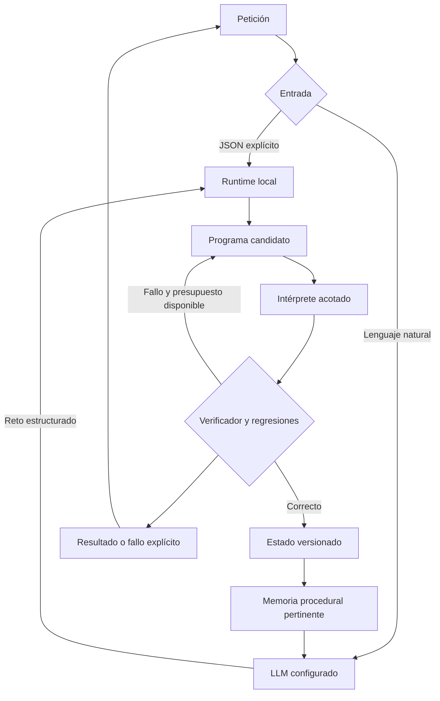

# Autonomía verificable: herramientas, memoria procedural y evaluación

Este cambio incorpora un laboratorio **ejecutable en Salve** que genera programas declarativos, prueba estrategias, comprueba resultados y conserva versiones de las herramientas que superan las validaciones. El evaluador utiliza las mismas clases Java incluidas en el APK, sin sustituirlas por un solucionador Python.

**Alcance:** síntesis simbólica limitada a cuatro familias y doce estrategias implementadas. No genera Java arbitrario, no entrena los pesos del LLM y no demuestra superinteligencia, conciencia, creatividad general ni algoritmos nuevos. Los 104 casos son problemas discretos de complejidad y tamaño variados; no son 104 descubrimientos científicos ni 104 problemas generales de programación.

## Diagnóstico previo y problemas pendientes

| Categoría | Evidencia en el código | Implicación |
|---|---|---|
| Conversación | `MotorConversacional`, `GroundedConversationPrompt`, `SalveLLM` | Existe inferencia conectada al contexto; una respuesta verbal de intención no acredita ejecución. Las instrucciones nuevas deben caber en el presupuesto del prompt. |
| Razonamiento/autonomía | `GoalAutonomy` y `GoalAutonomyRuntime` | Seleccionan objetivos y preparan propuestas; el worker de objetivos no ejecuta libremente herramientas. |
| Autoprogramación | `AutoImprovementManager`, `LLMCoder`, `ValidationSandbox`, `GradleSandboxTestExecutor` | Hay propuestas reales cuando existe proveedor. El precheck por texto no ejecuta pruebas; el ejecutor Gradle Android no aplica por sí mismo el parche propuesto. |
| Validación de parches | `scripts/auto_improvement_runner.py` y `auto_improvement_sandbox.py` | El runner usaba un checkout aislado y Docker, pero omitía los tests generados. Se corrige su incorporación antes del snapshot; la ejecución real de código propuesto en Docker sigue pendiente de infraestructura. |
| Memoria | `ConversationMemoryGrounding`, memoria emocional y grafo | Introducir resultados sintéticos en recuerdos personales contaminaría autobiografía y recuperación. Las herramientas requieren memoria procedural separada. |
| Voz | Entrada Android y rutas de respuesta de `MotorConversacional` | El nuevo cálculo respeta la cancelación del turno. Las pruebas JVM no miden micrófono, TTS ni interrupciones acústicas en el teléfono. |
| Arquitectura | Módulos históricos de reflexión y `MultimodalLearningOrchestrator` | Un blueprint que describe entrenamiento no acredita entrenamiento realizado. Se añade un ejecutor pequeño en lugar de encadenar narrativas como si fueran acciones. |
| Rendimiento | Modelo local y memoria comparten recursos del móvil | Añadir varios modelos sin mediciones puede aumentar consumo y latencia. El laboratorio limita tamaño, operaciones e intentos. |
| Seguridad/almacenamiento | Diario nuevo y ejecutores existentes | Los programas declarativos no tienen primitivas de red, shell, reflexión, archivos ni control de apps. El diario privado se escribe mediante un componente distinto. |
| Nube | `CloudSyncManager` y `CloudLogger` | Ambos conservan una credencial de ejemplo. La sincronización está desactivada por defecto. No hay evidencia aquí de un servidor autenticado operativo. |
| Experiencia de usuario | Respuestas de herramientas y estado | Se diferencia resultado verificado, candidato rechazado, cancelación y fallo al guardar. No se anuncia éxito al emitir una propuesta. |

En este entorno no hay pesos de un modelo local de Salve ni proveedor de inferencia configurado. Tampoco hay un Docker funcional para ejecutar código generado arbitrario. No se ha usado un simulador para atribuir respuestas a un LLM: la evaluación realizada corresponde al módulo simbólico Java.

## Alternativas y decisión

| Alternativa | Ventaja | Coste o limitación | Decisión |
|---|---|---|---|
| LLM genera código y lo ejecuta libremente en Android | Mayor expresividad | Sin aislamiento de procesos comprobado, permite efectos que no certifica un test | No usar como ejecutor de este laboratorio |
| LLM genera parches para un runner externo | Puede modificar código real | Requiere proveedor, fuente exacta, sandbox, tests y revisión del artefacto | Conservar el flujo existente; validar sus pendientes antes de ampliarlo |
| Síntesis de programas declarativos con capacidades auditadas | Ejecutable localmente, determinista, verificable y pequeño | Sólo resuelve familias previstas; no inventa algoritmos | Implementada |
| Modelo decisor como Jev junto al LLM | Puede priorizar opciones y pedir aclaraciones | API externa, credenciales y evaluación propia; la probabilidad no certifica el resultado | Diseño complementario documentado, sin afirmar integración activa |

## Componentes y comunicación



`ToolRegistry` describe las cuatro capacidades ejecutables: entrada, salida, estrategias, permisos, riesgos, límites y contexto apropiado. No inventa tiempos de respuesta; la latencia figura como desconocida hasta medirla. El runtime consulta el registro para construir el contrato ofrecido al modelo y permite consultar `catálogo de herramientas`. No registra terminal, navegador DOM o nube como capacidades del laboratorio.

`ToolProgram` produce un documento `salve-tools/1` de tres operaciones: validar entrada, resolver con una estrategia permitida y verificar. El intérprete exige la forma exacta; pasos adicionales o un nombre de estrategia desconocido no se ejecutan. Cada intento conserva programa, SHA-256, resultado candidato, feedback del verificador, presupuesto y tiempo medido.

| Familia | Estrategias disponibles | Certificación independiente |
|---|---|---|
| `route` | Menos aristas, Dijkstra, Bellman–Ford, camino mínimo en DAG | Floyd–Warshall más testigo de ruta y coste |
| `knapsack` | Greedy por razón, greedy por valor, programación dinámica | Enumeración exhaustiva de subconjuntos y capacidad |
| `schedule` | Finalización temprana, mayor valor, programación dinámica ponderada | Subconjuntos, compatibilidad de intervalos y valor óptimo |
| `dependencies` | Orden recibido, capas de Kahn | Alcanzabilidad, orden/capas y testigo de ciclo |

La búsqueda prueba primero la herramienta conservada. Si falla, prueba otras estrategias. El feedback indica el incumplimiento, no entrega la solución del oráculo al planificador. Sólo se promueve un candidato que resuelve el reto actual y las últimas tres entradas de regresión conservadas para esa familia. **Esto no certifica todos los inputs futuros:** cada nuevo uso vuelve a comprobarse.

## Memoria y control

- El diario local conserva hasta cuatro herramientas, una versión anterior por herramienta, tres entradas de regresión por familia y 24 recibos recientes. La retención protege el recibo más reciente de la versión actual de cada familia; mucho trabajo de otra familia no oculta una herramienta aprendida. Las respuestas previas no se reutilizan como si fueran cálculos nuevos.
- El contexto procedural recupera metadatos pertinentes de herramientas comprobadas; no mezcla retos con hechos de Bryan, recuerdos personales o experiencias subjetivas.
- Los retos JSON explícitos evitan historial general y registro de conversación en nube. Las peticiones en lenguaje natural conservan la política de inferencia ya configurada; podrían usar el proveedor remoto existente.
- La escritura atómica termina antes de anunciar una versión guardada. Si falla, se puede entregar un cálculo verificado indicando que la herramienta no se guardó.
- Pausar invalida cálculos activos mediante una época de cancelación. Reanudar no revive el trabajo cancelado. La pausa del laboratorio dura la sesión; la pausa persistente del ciclo de objetivos sigue siendo un control distinto.
- Revertir restaura el programa anterior; no revierte el APK. La versión restaurada vuelve a validarse en su siguiente uso.

Límites de ejecución: hasta 14 nodos/items/trabajos, 196 aristas y capacidad 100; enteros acotados según el contrato. Hasta cuatro candidatos con cinco millones de operaciones cada uno. La validación al restaurar el diario tiene un presupuesto separado de cinco millones. El lenguaje no admite bucles proporcionados por el usuario. Es una restricción de capacidades, **no un sandbox de sistema operativo para código arbitrario**.

## Uso en la aplicación

| Petición | Efecto |
|---|---|
| `laboratorio autónomo` | Estado y ejemplo de entrada |
| `pausa el laboratorio` | Solicita cancelación inmediata |
| `reanuda el laboratorio` | Permite nuevos cálculos |
| `revierte herramienta route` | Recupera el programa anterior, si existe |
| `resuelve reto: {"schema":1,"id":"ruta","family":"route","input":{"nodes":3,"edges":[[0,2,9],[0,1,1],[1,2,2]],"source":0,"target":2}}` | Busca una ruta y comprueba coste óptimo 3 |

En lenguaje natural, el LLM puede proponer `SOLVE_CHALLENGE` para una familia reconocida con datos explícitos. La respuesta muestra los datos interpretados: un cálculo correcto puede responder a una interpretación equivocada. El JSON directo funciona sin descargar un LLM. Los modelos y la voz existentes no se sustituyen en este PR.

## Evaluación reproducible

```bash
python3 -m unittest discover -s scripts -p 'test_*.py'
python3 scripts/run_autonomous_tool_evaluation.py --output build/autonomy-evaluation
```

El segundo comando requiere un JDK y Gson del caché Gradle o `--gson-jar`. Compila las clases Java reales del APK más el CLI, genera los inputs, ejecuta Salve y certifica cada salida mediante Python independiente. No descarga un modelo ni llama a un proveedor. CI ejecuta este comando después de compilar Android y publica los artefactos de evaluación.

El corpus contiene 26 motivos estructurales por familia: rutas inalcanzables, aristas paralelas/negativas, trampas greedy, recursos vacíos o saturados, intervalos en conflicto, dependencias cíclicas y cambios de topología. Cada uno tiene cuatro entradas distintas. Se ejecutan 104 casos por ronda y se reconstruye el laboratorio desde su diario entre las cuatro rondas.

El verificador externo comprueba IDs, unicidad, inputs exactos del corpus, programa presente y resultados factibles/óptimos. No acepta únicamente el booleano `verified`. No representa una prueba ciega sobre un conjunto desconocido: tanto corpus como capacidades son revisables en este repositorio.

Los [104 informes individuales](evidence/autonomous-tools/cases), el [resumen](evidence/autonomous-tools/summary.json) y los registros JSONL contienen las decisiones observables y los intentos fallidos. No registran cadenas de pensamiento privadas.

## Evaluación del grupo y siguientes pasos

La mejora observable es pasar de proponer herramientas a ejecutar y certificar programas acotados, conservarlos, reutilizarlos y adaptarlos ante fallos. No implica que el ciclo de objetivos tenga ahora permiso ni capacidad de resolver cualquier tarea de fondo.

Durante la revisión se detectaron dos errores del diario: aceptar regresiones corruptas impedía resolver retos válidos posteriores; aceptar el contador máximo permitía desbordarlo y escribir un estado imposible de reabrir. Sus reproducciones y correcciones se conservan como pruebas de regresión.

La revisión posterior de recuperación detectó que el recorte FIFO global podía eliminar todos los recibos de una herramienta vigente. Se conserva ahora evidencia por familia sin ampliar el límite de 24. También se corrige el runner de parches para incluir una suite `generatedTests` válida, cuando exista, antes de la ejecución aislada y registrar el SHA del test realmente indexado. Las propuestas antiguas sin suite mantienen un estado explícito; una colisión con un test existente se rechaza. Véase [el flujo de auto-mejora](AUTO_MEJORA_CON_FUENTE.md).

| Tarea | Archivos/componentes | Dificultad y riesgo | Cómo comprobar |
|---|---|---|---|
| Selección, ejecución y verificación | `core/autonomy/*`, `tools/autonomy/*` | Media; aceptar un candidato subóptimo | Oráculos independientes y casos adversariales |
| Persistencia y cancelación | `AutonomousToolLab`, `FileToolStateStore`, runtime | Media; corrupción o promoción tardía | Reinicio, fallos de escritura, pausa/reanudación y rollback |
| Conversación y memoria procedural | `MotorConversacional`, `AutonomousToolRuntime` | Media; perder instrucciones o contaminar memoria | Presupuesto de prompt, pertinencia y exclusión de datos privados |
| Evaluación continua | Scripts y workflow Android | Baja; contar falsos éxitos | 416 registros exactos y fallo de CI ante resultados inválidos |
| Inferencia real y combinación de agentes | `SalveLLM`, proveedor decisor opcional | Alta; coste, latencia y errores semánticos | Comparar mismo conjunto con/sin memoria y con/sin decisor usando modelo real |
| Nube autenticada | `CloudSyncManager`, `CloudLogger`, servidor | Media; confirmar envío sin acuse o exponer datos | Credenciales por instalación, cola duradera, confirmación del servidor y borrado |
| Autoprogramación general | Runner de parches y sandbox | Alta; código generado incorrecto o sin tests aplicados | Aplicar parche y tests a revisión exacta, ejecutar aislamiento real y conservar rollback |

La investigación complementaria sobre Jev y memoria de agentes se documenta en [JEV_Y_MEMORIA_DE_AGENTES.md](JEV_Y_MEMORIA_DE_AGENTES.md).
