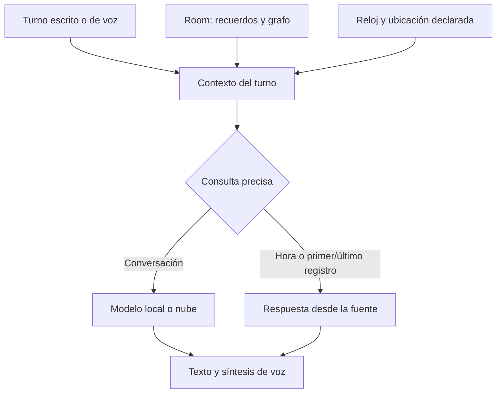

# Memoria y datos reales en la conversación

## Diagnóstico comprobado

- `ReasoningPlanner` sólo recuperaba memoria ante unas pocas palabras clave. Preguntar «¿Cuál fue tu primer recuerdo?» no activaba esa ruta.
- `MemoriaEmocional.recuperarContextoRelevante` buscaba palabras de la pregunta entre recuerdos recientes. No existía consulta cronológica del primer registro ni recuperación por categoría del perfil.
- `MotorConversacional.buildSystemPrompt` añadía una narrativa del grafo generada por otro modelo, potencialmente vacía, sin consultar nodos o conexiones pertinentes.
- No se proporcionaba al modelo el reloj ni la zona horaria configurada del teléfono. El sistema de sensores no dispone de geolocalización en esta ruta.
- Las escrituras manuales creaban hilos anidados independientes y fechaban el registro cuando se insertaba; el orden podía variar. El texto pasaba por un diccionario de códigos que perdía mayúsculas y formato.
- El historial tenía un límite de 16 mensajes/8000 caracteres, pero no existía un presupuesto para el prompt completo.

## Cambio de arquitectura

`ConversationMemoryGrounding` consulta Room, conserva identificadores y fechas y recupera hasta cuatro recuerdos, cuatro nodos y cuatro conexiones. Recorre sólo una conexión desde los nodos encontrados. Perfiles y consultas cronológicas tienen prioridad; un perfil ausente no se reconstruye desde prosa del grafo. Se distingue consulta vacía, sin coincidencias, parcial y error de lectura.

La búsqueda de temas sigue siendo léxica, complementada por conexiones del grafo. No modifica los pesos del modelo ni transforma el grafo en una red neuronal entrenada. El modelo recibe evidencia y la interpreta/verbaliza; las asociaciones del grafo no prueban por sí mismas que una afirmación sea real.

El primer recuerdo significa **el registro más antiguo que todavía está guardado**. Si es el manifiesto que crea la aplicación al iniciar, se identifica como configuración del sistema. No se inventa una primera vivencia ni se reconstruyen registros eliminados. Se mantiene la base de datos existente, sin cambio de esquema ni migración destructiva.

Las escrituras de esta instancia comparten una cola. Antes de recuperar evidencia se espera, con límite de tres segundos, a las escrituras anteriores. Si alguna escritura falló, la consulta comunica error de almacenamiento y no memoria vacía; una escritura posterior exitosa no oculta ese fallo. Las nuevas entradas conservan su texto y fecha de captura; las fechas históricas no se reescriben.

`DeviceClockContext` lee el reloj y la zona del dispositivo en cada consulta. No requiere internet. La hora es la configurada en el teléfono: no demuestra la ciudad del usuario ni corrige un reloj de Android mal configurado.

«Estoy en Quito» puede aportar ubicación temporal declarada durante un máximo de dos horas. Se reemplaza al corregirla, caduca y desaparece al limpiar/reiniciar la sesión. «Vivo en Quito» sigue siendo residencia persistente. No se activa GPS ni se deduce una zona horaria a partir del nombre de una ciudad. Preguntar la hora de otra ciudad requiere una conversión verificada que este cambio no añade.

`GroundedConversationPrompt` construye una sola petición para los proveedores local/nube y para texto/voz; también se usa en consultas de fotos. Prioriza entrada actual y evidencia y limita el historial y la configuración. Los campos de datos se escapan y un recuerdo citado nunca pasa directamente por el intérprete de herramientas. Las autorizaciones de herramientas siguen comprobándose en la aplicación: delimitar texto no elimina por completo la inyección de prompts.

El límite global se expresa en caracteres (10500; 3200 para modelos heredados `.task`). Es una aproximación conservadora, **no una garantía de tokens**. Un modelo con ventana muy pequeña puede seguir necesitando un contexto menor. La configuración extensa de estilo/animación y el historial antiguo pueden omitirse antes que los datos del turno.

## Comprobación

- Pruebas JVM de cronología, perfiles, nodos/aristas, fuentes, errores, vacío, límites y conservación del texto.
- Pruebas de reloj fijo, cambio de zona y horario estacional.
- Pruebas de ubicación temporal: correcciones, negación, caducidad, reinicio, mensajes de asistentes e historial largo.
- Pruebas del prompt compartido: evidencia, roles, caracteres escapados, entradas grandes y proveedores locales/nube.
- Compilación Android completa y generación de APK ARM64.

Los logs nuevos incluyen sólo estado de recuperación y longitud del prompt. No contienen textos recuperados, ubicación ni conversación. Esto no cambia todos los logs históricos de otros módulos.

Prueba manual pendiente en el dispositivo con su modelo seleccionado:

1. Preguntar «¿Qué hora es?» sin conexión: comparar con Android.
2. Decir «Estoy en Quito» y preguntar «¿Dónde estoy?». Debe atribuirlo a tu declaración, sin afirmar GPS.
3. Corregir «Ahora estoy en Lima»; comprobar que no mantiene Quito como lugar actual.
4. Decir «Vivo en Bogotá», cerrar/reabrir la aplicación y preguntar «¿Dónde vivo?».
5. Preguntar «¿Cuál fue tu primer recuerdo?» y «¿Cuál es tu último recuerdo?». Debe citar los registros conservados y reconocer configuración inicial si corresponde.
6. Repetir por voz; comprobar que respuestas y hechos coinciden con el chat.

La compilación y las pruebas de contrato no equivalen a haber ejecutado inferencia ni audio en el S24 Ultra.
