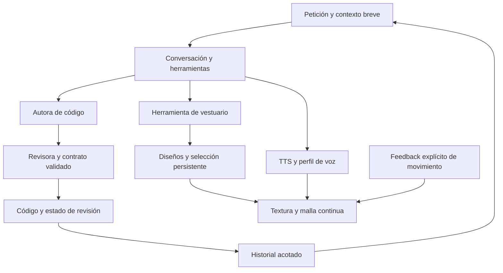

# Salve: cuerpo continuo, vestuario creativo, voz y equipo de código

Base: `672c1814af0d4f63896b92423836f4bf3acd40fa` (PR 74 integrada).

## Diagnóstico comprobado antes de modificar

- **Movimiento:** cabeza y rostro usaban malla; brazos y piernas eran recortes rotados aparte. Los pivotes no seguían las deformaciones del torso. La marcha dependía del reloj absoluto, y la imagen se volteaba al detener un paso hacia la izquierda. No había aprendizaje de movimiento.
- **Capas y posturas:** el PNG frontal no contiene volúmenes ni superficies ocultas. Añadir láminas desde otros ángulos no produce un esqueleto 3D. El objetivo de esta preparación es permitir rigging posterior, no cambiar el significado de “cualquier postura”.
- **Vestuario:** no existían plantillas nuevas ni una herramienta que guardara diseños. El método denominado `generateImage` analiza fotografías y devuelve texto; no genera ilustraciones.
- **Modelos:** los roles de `SalveLLM` eran instrucciones para un único modelo. LiteRT mantiene una Engine; el router puede usar Gemini si está configurado. No había intercambio de borrador y revisión para el comando conversacional de programar.
- **Código:** esa ruta usaba una respuesta legacy y podía tratar texto de fallo como código/aprendizaje. Al sustituirla, la revisión detectó además que el fragmento debía permanecer en contexto corto para poder corregirlo después.
- **Voz:** TTS Android ya funcionaba con eventos de inicio/rango/fin, pero no había selección de voz y perfil persistente. Un perfil no equivale a entrenar una voz exclusiva.
- **Descargas:** el diálogo prometía elegir un nuevo cerebro, aunque el backend sólo solicita el modelo fijado en el catálogo y puede rechazar la operación. Ahora informa solicitud, bloqueo o error.

## Elección de arquitectura

Se conserva el renderer Android ligero y se corrige su continuidad. La alternativa inmediata de aumentar los ángulos de recortes independientes agrandaría las roturas. Sustituirlo directamente por un motor 3D tampoco crearía las mallas, pesos y expresiones que faltan.



| Trabajo | Solución y archivos principales | Dificultad / riesgo | Comprobación |
|---|---|---|---|
| Uniones y marcha | `AvatarRig`, `IllustratedAvatarRenderer`, `AvatarLocomotion`, `AvatarView`: vértices compartidos, pesos suaves y fase por desplazamiento | Media; todavía puede arrastrar pelo/falda con el brazo en una textura plana | Continuidad, triángulos sin invertir, marcha y revisión visual |
| Nuevos diseños | `AvatarDesign*`, `AvatarWardrobe*`, `AvatarClothingStyle`, sala y hooks del motor | Media; orden de selección, IO y bordes de máscara | Persistencia, fallos reales de escritura, parser estricto y apariencia |
| Adaptación | `MotionPreferenceProfile/Store`, director y sala | Baja; no alterar TTS ni caducidad | Comparación de voz/parpadeo/estado con y sin feedback |
| Autor y revisor | `AuthorReviewerCodeCoordinator`, router, Gemini, motor e historial | Media; revisión incorrecta, formato inválido o más latencia | Presupuesto, cancelación, localOnly, contexto y modelo real |
| Voz | `VoiceProfile/Store`, `VoiceSelectionPolicy`, motor y menú principal | Media; depende de las voces instaladas | Selección y límites JVM; escucha física pendiente |

## Qué funciona en esta entrega

### Movimiento conectado y adaptación

El renderer dibuja una malla continua de la textura completa. Las cadenas hombro→codo y cadera→rodilla aplican pesos suaves; los triángulos vecinos comparten vértices. Se eliminó el borrado de miembros y el relleno de pelo de este camino. La ilustración original neutra permanece intacta.

La marcha usa distancia recorrida, con transición al arrancar/parar; no invierte la ilustración al detenerse. Los límites son deliberadamente pequeños para evitar estirar la textura. No hay ahora una rotación espacial ni una postura arbitraria generada a partir de texto.

La sala permite **Más suave**, **Más despacio**, **Así está bien** y **Restablecer**. Guarda preferencias acotadas: intensidad 45–100% y ritmo 65–100%. Cambia gestos existentes, no voz, parpadeo, mirada, respiración ni vencimiento de eventos. Es adaptación por feedback explícito, no entrenamiento de pesos ni aprendizaje de una postura inédita.

### Prendas y herramienta de creación

Hay tres plantillas: vestido original, pijama y exploradora. Las dos nuevas ilustraciones se incluyen en la app; se conserva la cabeza original y se combina con el cuerpo vestido. Cara y pelo inferior de una nueva lámina no se describen como todos los píxeles idénticos al original: la identidad se revisa visualmente.

La herramienta crea diseños de plantilla + paleta + patrón y los guarda en `files/avatar/wardrobe.json`, con escritura atómica, hasta 24 diseños, identificadores asignados por la app y selección persistente. No permite rutas, URLs ni código arbitrario. El original se puede recuperar y está protegido contra borrado.

```json
{"tool":"AVATAR_CREATE","name":"Noche lavanda","template":"pajamas","color":"LAVENDER","pattern":"STARS","wear":true}
```

También admite `AVATAR_LIST`, `AVATAR_WEAR` y `AVATAR_DELETE`. La sala permite probarlo sin depender de que el modelo produzca el formato correcto. El resultado confirma la operación realizada; guardar/seleccionar no se presenta como una generación de PNG nueva.

Para generar dibujos completamente nuevos dentro de Salve falta un proveedor de imagen o un modelo gráfico compatible. Esta sesión ha generado recursos mediante `image_gen`; esa capacidad no se transfiere automáticamente a la app. Los prompts y archivos están documentados, y no se añade un servicio ficticio.

### Colaboración de modelos

La propuesta para el S24 es **un LLM local residente**, con roles que se ejecutan por turnos. La ruta de código añade autora→revisora y un contrato de resultado: borrador, revisión aceptada/corregida/rechazada o fallo. Cuenta hasta tres llamadas reales incluyendo alternativas; no lanza un grupo ilimitado de inferencias.

En modo local ambas funciones utilizan el modelo local seleccionado. Si Gemini está configurado y el modo local está desactivado, puede elegirse un modelo revisor distinto en **IA y cámara → Equipo de programación**, sin cambiar el modelo de charla. No se descargaron modelos extra ni se demuestra que más modelos siempre mejoren la respuesta.

El código generado es un fragmento Java pequeño, con límites explícitos y revisión estructurada. No se instala, compila ni ejecuta automáticamente. Una revisión del modelo sigue siendo una opinión técnica, no una prueba. El contexto mantiene el código para seguir corrigiéndolo; la voz sólo lee el resumen. Cuando falta el fragmento o supera el presupuesto, se pide reducirlo o recuperarlo.

Presupuestos: 3000 caracteres de petición, 6000 de código, 9000 por prompt y contexto breve de 16 mensajes/8000 caracteres. Son límites de caracteres; no constituyen una equivalencia exacta con tokens.

### Voz y personalidad

**IA y cámara → Voz de Salve** permite elegir entre voces españolas que informa el motor TTS instalado, guardar ritmo/tono y escuchar una muestra. El perfil inicial usa ritmo 0,95 y tono 1,04; no presupone que una voz sea femenina, tímida o de cierta edad por su identificador.

Las voces que necesitan conexión están desactivadas por defecto y se distinguen explícitamente. El perfil conversacional pide cercanía, curiosidad y timidez discreta sin tartamudeos fingidos ni muletillas. Se combina configuración persistente y lógica de voz con una instrucción corta de estilo.

Para una voz realmente exclusiva harían falta datos de voz autorizados, un sistema de síntesis específico y evaluación en el teléfono. Aquí se configura una voz existente; no se afirma haber entrenado ni clonado una nueva.

## Capas para más posturas

Se prepararon ocho vistas y piezas frontales, de tres cuartos, perfil y espalda. El [paquete artístico y plan de articulaciones](art/avatar/README.md) incluye recursos, huellas, jerarquía de huesos y anclajes iniciales.

Las capas aún necesitan alineación, mallas, pesos, manos articuladas, rasgos faciales y pruebas de oclusión. Para posturas vistas desde cualquier ángulo, el siguiente resultado necesario es un modelo 3D real con esqueleto y texturas, exportado y validado; este commit no contiene tal modelo. El material de preparación queda fuera del APK.

## Validación y límites

La compilación Android con SDK 36, JBR 21 y Gradle 9.7.1 terminó correctamente: **301/301 pruebas en 46 suites**, sin fallos, errores ni omisiones. APK ARM64 de depuración: **145,881 MiB** (152.967.696 bytes), firma v2 verificada. Los pesos generativos del LLM siguen fuera del APK; el PNG original conserva su SHA-256. [Evidencia de compilación](evidence/embodied-avatar-build.json).

SHA-256 del APK `salve-s24-creative-avatar-debug.apk`: `11f688efc7af77f42725745d577d8c5368adc93bf37dfc057398d2d73eefb532`.

Se revisaron **18 muestras visuales**, incluyendo pijama, exploradora y acentos. La comparación original/neutro dio **0 diferencias en 393.216 píxeles** a 512 × 768 y ningún error de JavaScript. Se corrigió el tinte que antes terminaba en un rectángulo sobre el pantalón; ahora el acento del pijama termina suavemente en la camisa. Las pruebas geométricas recorren 162 combinaciones extremas sin invertir triángulos. [Evidencia visual](evidence/embodied-visual-check.json).

La vista previa y el vídeo ejecutan un renderer de navegador equivalente con una secuencia programada del director; no prueban Android, TTS real ni rendimiento físico del teléfono.

La prueba de código con **Gemma 4 E2B real y LiteRT-LM 0.16.1 en CPU Linux** falló inicialmente porque la revisión incluía Markdown; el parser la rechazó. Tras precisar la instrucción, la misma tarea produjo código y JSON válido: autora 2,610 s, revisora 2,723 s y estado `REVIEWED` con dos llamadas. Se mantuvo el parser estricto. Es un caso breve, con caché caliente, sin Android y sin ejecutar el código generado; no demuestra calidad general. Evidencia [inicial](evidence/code-team-inference-baseline.json) y [posterior](evidence/code-team-inference.json).

Siguen pendientes las pruebas físicas de voz, consumo, latencia y superposición en el S24. El scheduler cognitivo anterior no se convierte en un planificador eficaz por añadir estos dos roles; la prioridad de inferencia de tareas de fondo requiere otra revisión. Tampoco se ha demostrado generación arbitraria de imágenes en el móvil, una voz entrenada propia, ni aprendizaje autónomo de nuevas posturas.

Siguiente grupo: ajustar y validar el rig completo; evaluar modelos candidatos con tareas reales antes de añadir descargas; conectar un generador gráfico elegido; y medir voz/latencia y consumo en el teléfono. Cada nueva capacidad debe declararse disponible sólo cuando su backend, recursos y pruebas lo confirmen.

Fuentes primarias: [TTS Android](https://developer.android.com/reference/android/speech/tts/TextToSpeech), [voces y conexión](https://developer.android.com/reference/android/speech/tts/Voice), [separación de material](https://docs.live2d.com/en/cubism-editor-manual/divide-the-material/), [jerarquías de deformación](https://docs.live2d.com/en/cubism-editor-manual/system-of-parent-child-relation/) y [skinning glTF](https://registry.khronos.org/glTF/specs/2.0/glTF-2.0.html#skins).
