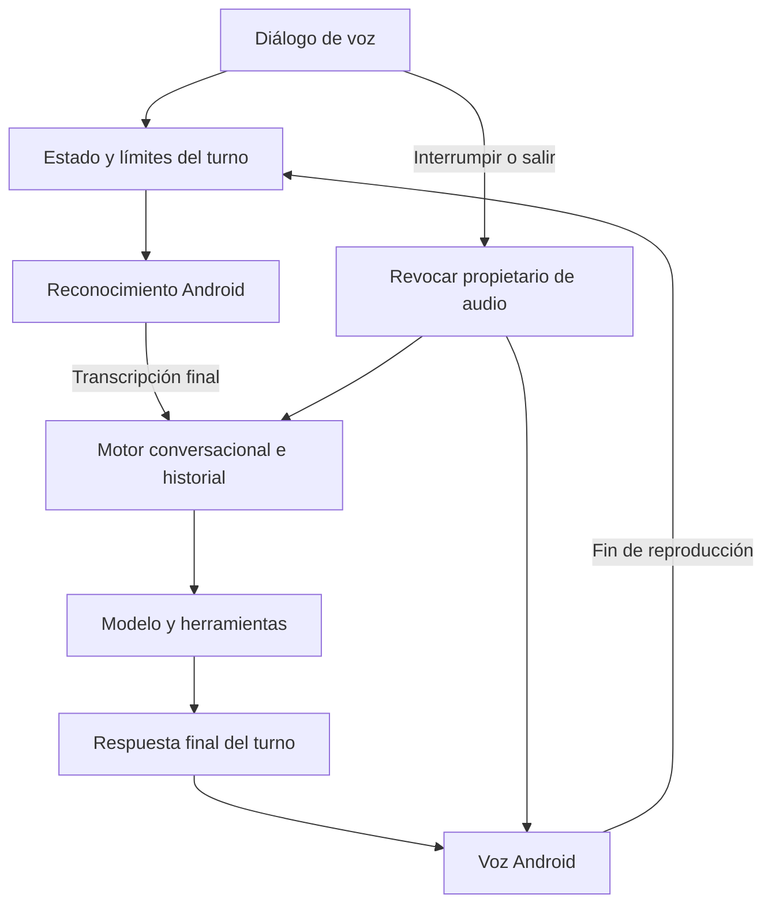

# Conversación hablada y percepción temporal

Esta entrega permite encadenar turnos hablados desde la conversación principal, reutilizando el modelo y el historial existentes. No incorpora pesos neuronales nuevos ni modifica la identidad gráfica de Salve.

## Diagnóstico comprobado en el código

| Componente | Qué hace realmente | Límite comprobado |
| --- | --- | --- |
| `SalveLLM.java` y `LiteRTLlm.kt` | Cargan un modelo entrenado y ejecutan inferencia real; el catálogo permite descargar pesos fuera del APK. | La instalación, memoria disponible y velocidad deben comprobarse en el teléfono. |
| `KnowledgeNodeEntity`, `KnowledgeRelationEntity`, `GrafoConocimientoVivo` | Guardan conceptos y relaciones en un grafo persistente. | Sus nodos no son neuronas entrenadas. |
| `CognitiveCore`, `LiquidNeuralLayer`, `ConceptSpace` | Experimentan con una red recurrente pequeña y vectores inicializados aleatoriamente. | No sustituyen al modelo de lenguaje; el turno conversacional actual no utiliza esa red como motor de respuesta. La capa contiene 6.336 parámetros, no los aproximadamente 19.000 que indicaba el comentario anterior. |
| Reconocimiento anterior de `MainActivity` | Transcribía un turno mediante el servicio de Android. | No volvía a escuchar automáticamente al terminar el TTS. |
| `MotorConversacional` | Genera respuestas, usa el historial y habla mediante el TTS instalado. | Había respuestas provisionales y callbacks asíncronos sin un propietario de voz común. |
| `SistemaSensorial` anterior | Registraba sensores reales al construirse; había otra instancia en Main. | No delimitaba la observación ni liberaba correctamente los listeners; faltaban caducidad y validación de lecturas. |

No se conecta `InstintoSupervivencia`: atribuir dolor o peligro existencial a una batería baja no es una interpretación fundada. La percepción nueva describe medidas y disponibilidad, sin convertirlas en emociones supuestamente experimentadas.

## Cómo usar el modo de voz

1. En la pantalla principal, pulsar **Modo voz: conversar con Salve** y conceder micrófono si Android lo solicita.
2. Hablar cuando aparezca **Te escucho…**. Las transcripciones parciales solo se muestran; únicamente el resultado final se envía al motor conversacional.
3. Salve prepara y pronuncia su respuesta. Al acabar vuelve a escuchar automáticamente.
4. Para adelantar el turno, pulsar **Interrumpir y hablar**. Para salir, pulsar **Salir del modo voz** o decir **termina el modo voz** mientras escucha.

El botón anterior de dictado de un solo turno sigue disponible. El diálogo no añade grabaciones, archivos de audio ni registros de transcripciones. Los turnos conversacionales ordinarios conservan las políticas existentes de historial, memoria y proveedor de IA; no se promete que toda conversación sea exclusivamente local.

## Componentes y transiciones



- `VoiceConversationLoop` separa estado y temporizadores de Android: escucha, preparación, reproducción, espera y cierre. Tiene límites de sesión (10 minutos), captura (60 segundos), respuesta (120 segundos) y síntesis (120 segundos). Un resultado de reconocimiento puede llegar antes del límite de captura.
- `LiveVoiceDialog` posee el reconocedor, el foco de audio y un único temporizador. Lo destruye antes de generar o reproducir una respuesta. Mantiene la pantalla encendida durante la sesión y libera esa petición al terminar. Se cierra al abandonar la actividad; una llamada o pérdida de foco termina la sesión.
- `LiveVoiceChannel` identifica al propietario mediante un objeto revocable, además del número de turno. Reabrir otro diálogo con el mismo número no permite aceptar callbacks anteriores.
- `VoiceReplyBatch` reúne respuestas provisionales y continuaciones relacionadas. En voz se pronuncia la respuesta final cuando terminan; el texto «Prepararé un fragmento» no abre el micrófono a mitad de la generación del código.
- `MotorConversacional` propaga el propietario en las continuaciones compatibles y vincula `onStart`, `onDone`, `onError` y `onStop` del TTS al diálogo. Una respuesta ajena al modo de voz no debe cortar su audio.

La conversación general, generación de fragmentos de código, comandos privados y herramientas con finalización explícita usan ese contrato. Los flujos antiguos de investigación recursiva, interrogatorio de seguridad, forja de herramientas y ejecución de rutinas no exponen una finalización fiable: el modo de voz indica que deben abrirse desde el chat y no los inicia. Se mantienen sus rutas escritas. Una confirmación humana en una tarjeta de otra aplicación tampoco mantiene abierto un turno esperando indefinidamente: informa de la tarjeta y muestra su resultado posterior por escrito. Abrir otra actividad termina la sesión de voz.

Después del TTS se esperan 300 ms antes de abrir el micrófono. Interrumpir revoca inmediatamente el turno y detiene la reproducción; esa misma espera permite disipar parte del sonido del altavoz. **No es cancelación de eco acústico**. Se permiten dos reintentos por silencio y uno por fallo transitorio; no hay un bucle ilimitado de errores.

### Alternativas consideradas

| Alternativa | Ventaja | Coste o límite |
| --- | --- | --- |
| Turnos automáticos con ASR/TTS de Android, implementados aquí | Sin modelos adicionales en el APK; utiliza componentes reales ya presentes. | Calidad, idiomas y disponibilidad dependen del servicio instalado; se espera el texto final del modelo. |
| Audio simultáneo con VAD, cancelación de eco y ASR incremental | Permitiría interrumpir hablando y reducir pausas. | Requiere otro pipeline de captura y pruebas de altavoz, auriculares y Bluetooth. |
| Servicio remoto de conversación de audio | Puede ofrecer audio incremental integrado. | Requiere proveedor, conexión, costes y una decisión explícita sobre tratamiento del audio. |

Se eligió la primera como avance comprobable. Android advierte que `SpeechRecognizer` no está pensado para reconocimiento continuo ilimitado y que la implementación puede transmitir audio a servidores. Por eso las sesiones son finitas, visibles y solo en primer plano. Se prefiere reconocimiento en el dispositivo cuando Android lo declara disponible; un fallo de ese servicio no se convierte silenciosamente en reconocimiento remoto. [Referencia de SpeechRecognizer](https://developer.android.com/reference/android/speech/SpeechRecognizer).

## Voz española y timbre

La selección automática prefiere voces españolas instaladas sin conexión, y dentro de ese grupo español mexicano, español estadounidense y otras variantes latinoamericanas. Una elección manual compatible tiene prioridad. El idioma de reconocimiento acompaña a la voz seleccionada; sin selección utilizable toma `es-MX`.

En **Voz de Salve**, usar **Guardar y escuchar** para elegir un timbre femenino agradable. La API estándar enumera idioma, nombre, calidad, latencia y necesidad de red, pero no proporciona un campo fiable de género. No se afirma haber creado una voz femenina exclusiva: modificar tono y velocidad no entrena una nueva voz. «Español neutro» es una preferencia de estilo y acento, no una propiedad verificable común a todos los motores. [Metadatos de Voice](https://developer.android.com/reference/android/speech/tts/Voice).

Los comandos de presupuesto, objetivos y sensores mantienen su requisito de TTS sin conexión. Si solo hay una voz de red, se muestra el texto y se detiene la sesión de voz; no se envía silenciosamente esa respuesta privada al sintetizador remoto. El reconocimiento de entrada es una decisión distinta y su modalidad se muestra en el diálogo.

## Sensores temporales

| Frase | Efecto |
| --- | --- |
| **Activa sensores** | Inicia una sesión de 30 segundos. |
| **Activa tus sensores durante 60 segundos** | Inicia una sesión de 60 segundos. |
| **Qué percibes ahora** / **Estado de los sensores** | Consulta lecturas de la sesión activa y su antigüedad. |
| **Desactiva sensores** | Detiene la observación inmediatamente y descarta muestras, sin esperar una inferencia encolada. |

Se leen luz, aceleración total (incluida gravedad), proximidad, temperatura ambiente y batería **solo si están disponibles**. No se presume que el Galaxy S24 Ultra tenga termómetro ambiental. La disponibilidad se consulta en ejecución, como recomienda la [guía de sensores de Android](https://developer.android.com/develop/sensors-and-location/sensors/sensors_overview).

Las muestras se mantienen en RAM y caducan tras cinco segundos. Se validan valores finitos, tiempos y escala de batería; se admiten temperaturas ambientales negativas válidas. La fecha de batería representa la consulta del estado de Android, no el instante físico de medida de su controlador. Un nuevo pedido no amplía una sesión ya activa. Salir de la actividad, cerrar el motor, ordenar parada o llegar al plazo libera listeners y borra muestras.

Estos comandos se resuelven antes del historial, memoria general y modelo; Main también evita registrarlos por su ruta de nube. Las lecturas no se guardan como recuerdos ni se incorporan automáticamente a prompts. Las sesiones no activan cámara, ubicación ni linterna.

Esto aporta percepción física verificable. No demuestra experiencia subjetiva. Para una siguiente etapa, sería útil convertir medidas verificadas en estados acotados —por ejemplo, teléfono en movimiento o iluminación baja— con procedencia y caducidad, y evaluar su precisión antes de permitir que afecten a decisiones o gestos. Añadir más redes aleatorias no proporciona esa capacidad.

## Validación y límites pendientes

Se ejecutaron **276 pruebas JVM correctas**: 85 de voz, 22 de sensores y 169 regresiones de historial, recuperación, memoria, finanzas, objetivos y políticas conversacionales. Cubren transiciones de voz, resultados tardíos, pérdida de audio, silencio, tiempos máximos, elección de voz, agrupación de respuestas y caducidad de sensores. Se comprobó la sintaxis de los Java modificados y los tipos del adaptador de voz y sensores con API 36. Los métodos de coordinación nuevos de Motor también se extrajeron del código para comprobar tipos con dependencias reales y sustitutos mínimos de servicios Android. Estas verificaciones son parciales: no sustituyen una compilación completa ni una ejecución Android.

Para repetir las pruebas en un entorno Android configurado:

```sh
./gradlew :app:testDebugUnitTest
```

Antes de considerar validado el producto en el S24 Ultra:

1. Hacer 20 turnos enlazados con preguntas que dependan de respuestas anteriores y probar silencios, dictado de 45 segundos y correcciones.
2. Medir fin de habla → transcripción final → respuesta del modelo → primer audio; registrar p50 y p95 sin guardar el contenido de la conversación.
3. Probar Interrumpir durante inferencia y TTS, cerrar/reabrir rápidamente, llamada entrante, pérdida de red y cambio a otra app; ningún callback antiguo debe hablar en una sesión nueva.
4. Probar altavoz, auriculares y Bluetooth: la pausa fija no garantiza ausencia de eco en todos los dispositivos.
5. Denegar micrófono, desinstalar datos de voz y seleccionar un idioma no disponible: debe mostrar la causa y liberar recursos.
6. Activar sensores, consultar antes/después de su caducidad, salir de la actividad y repetir la orden durante una inferencia larga: no debe quedar observación abierta ni aparecer una lectura inventada.

No se ha probado una APK en el teléfono. No hay wake word, VAD propio, interrupción acústica, conversación dúplex ni audio incremental del LLM. Cancelar un turno revoca su salida, pero no aborta una inferencia nativa ya iniciada: puede demorar una petición posterior. El siguiente avance debe partir de las medidas en el dispositivo para decidir entre mejorar este adaptador o sustituir la captura y reproducción por un pipeline de audio incremental.
